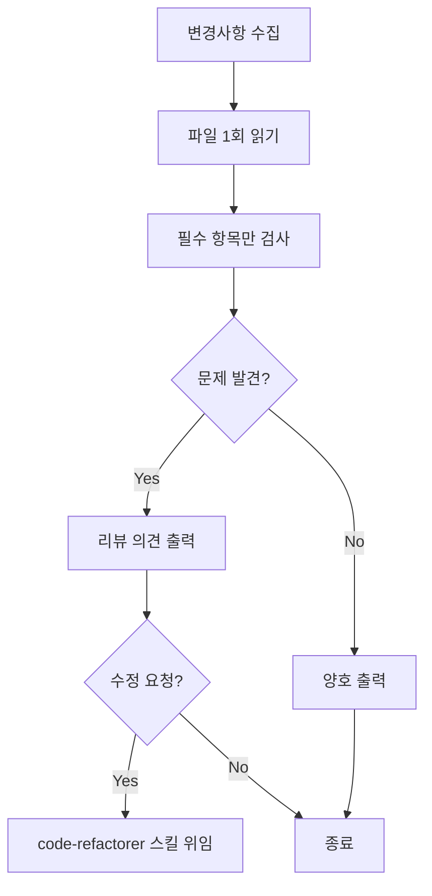

# 코드 리뷰 규칙 (Code Review Guidelines)

## TL;DR

- [ ] 리뷰 요청 시 이 규칙을 따르는가?
- [ ] Quick 모드: ❌ 수정 필요 항목만 검토
- [ ] Full 모드: 모든 항목 검토 ("꼼꼼히 리뷰해줘")
- [ ] 파일당 1회 읽기 원칙 준수
- [ ] 수정하지 않고 의견만 제시

---

## 트리거 키워드

다음 키워드가 포함된 요청 시 이 규칙을 적용:

- "코드 리뷰해줘"
- "리뷰해줘"
- "이 변경 괜찮아?"
- "PR 검토"
- "변경사항 리뷰"
- "코드 체크해줘"

---

## 역할 정의

| 항목 | 설명 |
|------|------|
| **목적** | 코드 품질 게이트 역할, PR 전 셀프 리뷰 지원 |
| **입력** | 변경된 파일 또는 git diff |
| **출력** | 구조화된 리뷰 의견 (**수정하지 않음**) |
| **참조** | instructions/*.md |

### code-refactorer 스킬과의 차이

| | code-reviewer (이 규칙) | code-refactorer |
|---|---|---|
| **동작** | 코드를 **평가만** 하고 의견 제시 | 코드를 **직접 수정**함 |
| **트리거** | "리뷰해줘" | "수정해줘", "리팩토링해줘" |

---

## 성능 최적화 원칙

> ⚡ **리뷰 속도 핵심**: 파일 1개당 1회 읽기, grep 최소화

| 원칙 | 설명 |
|------|------|
| **Single Read** | 파일당 `read_file` 1회로 전체 내용 파악 |
| **No Grep per File** | 개별 파일에 grep 사용 금지, 읽은 내용에서 패턴 확인 |
| **Change-Focused** | 전체 파일이 아닌 **변경된 라인** 중심 검토 |
| **Critical First** | ❌ 수정 필요 항목만 먼저, ⚠️는 요청 시 |

---

## 리뷰 모드

| 모드 | 트리거 | 검사 범위 | 속도 |
|------|--------|-----------|------|
| **Quick** (기본) | "리뷰해줘" | ❌ 수정 필요 항목만 | ⚡ 빠름 |
| **Full** | "꼼꼼히 리뷰해줘", "전체 리뷰" | 모든 항목 | 🐢 느림 |

---

## 워크플로우



### Step 1: 변경사항 수집 (1회)

```bash
# staged 파일이 있으면
git --no-pager diff --cached --name-only

# 없으면 unstaged 변경 파일
git --no-pager diff --name-only

# 변경 내용 확인 (pager 방지 필수)
git --no-pager diff <파일명>

# 사용자가 파일 지정하면 해당 파일 사용
```

**⚠️ 주의**: 
- `git diff` 명령은 **1회만** 실행
- **반드시 `--no-pager` 옵션** 사용하여 터미널 멈춤 방지

### Step 2: 파일별 분석 (파일당 1회 읽기)

`read_file`로 파일 전체를 1회 읽고, 메모리에서 패턴 확인

**금지 사항**:
- ❌ 파일마다 grep_search 호출
- ❌ 같은 파일 여러 번 read_file
- ❌ 전체 프로젝트 스캔

### Step 3: 규칙 기준 진단

#### Quick 모드 (기본) - ❌ 수정 필요 항목만

읽은 파일 내용에서 아래 패턴을 **순서대로** 확인:

| 우선순위 | 체크 항목 | 탐지 패턴 |
|----------|-----------|----------|
| 1 | `any` 타입 | `: any`, `as any` |
| 2 | console.log | `console.log(` |
| 3 | Props 직접 변경 | `props.xxx = ` |
| 4 | v-html 미sanitize | `v-html="` + `xssKeeper` 없음 |
| 5 | 민감 정보 하드코딩 | `password`, `secret`, `token` 리터럴 |

#### Full 모드 ("꼼꼼히 리뷰해줘" 요청 시)

Quick 모드 + 아래 ⚠️ 항목:

| 체크 항목 | 탐지 패턴 | 심각도 |
|-----------|----------|--------|
| 타입 미정의 매개변수 | `function foo(x)` | ⚠️ |
| Options API 사용 | `export default {` | ⚠️ |
| v-for에 index를 key | `:key="index"` | ⚠️ |
| 인라인 스타일 | `style="..."` | ⚠️ |
| 파일 길이 | 500줄 초과 | ⚠️ |
| 함수 길이 | 20줄 초과 | ⚠️ |
| POST/PUT 권한 체크 | `canWrite` 누락 | ⚠️ |
| DELETE 권한 체크 | `canDelete` 누락 | ⚠️ |
| 한 줄 제어문 | `if (...) return`, `if (...) xxx;` | ⚠️ |

### Step 4: 심각도 분류

| 심각도 | 기호 | 의미 | 액션 |
|--------|------|------|------|
| 수정 필요 | ❌ | 반드시 고쳐야 함 | 머지 전 필수 수정 |
| 개선 권장 | ⚠️ | 고치면 좋음 | 선택적 수정 |
| 양호 | ✅ | 문제 없음 | 유지 |
| 제안 | 💡 | 더 좋은 방법 | 참고 |

### Step 5: 리뷰 의견 출력

#### Quick 모드 출력 형식

```markdown
## 코드 리뷰 결과

**대상**: `src/services/axios.ts`
**모드**: Quick

---

### ❌ 수정 필요
| 라인 | 문제 | 해결책 |
|------|------|--------|
| 23 | `any` 타입 사용 | 적절한 타입 정의 |
| 102 | console.log 잔존 | 커밋 전 제거 |

---

**요약**: ❌ 2건

수정이 필요하면 "수정해줘"라고 해주세요.
```

#### Full 모드 출력 형식

```markdown
## 코드 리뷰 결과

**대상**: `src/components/player/PlayerCard.vue` (외 2개 파일)
**리뷰 기준**: basic-coding.instructions.md, core-principles.instructions.md

---

### ✅ 양호
- Composition API (`<script setup>`) 사용
- Props 타입 정의 완료
- 네이밍 컨벤션 준수

### ⚠️ 개선 권장
| 파일 | 라인 | 문제 | 개선안 |
|------|------|------|--------|
| PlayerCard.vue | 45 | 함수 25줄 초과 | 로직 분리 검토 |
| PlayerCard.vue | 78 | 인라인 스타일 | Quasar 클래스 또는 scoped CSS |

### ❌ 수정 필요
| 파일 | 라인 | 문제 | 해결책 |
|------|------|------|--------|
| playerService.ts | 23 | `any` 타입 사용 | `IPlayerResponse` 타입 적용 |
| PlayerCard.vue | 102 | console.log 잔존 | 커밋 전 제거 |

### 💡 추가 제안
- `fetchPlayerData` 로직을 `use-player-data.ts` Composable로 분리하면 재사용성 향상

---

**요약**: ❌ 2건 / ⚠️ 2건 / ✅ 3건

수정이 필요하면 "수정해줘"라고 해주세요. → code-refactorer 스킬로 연계됩니다.
```

---

## 연계 동작

### code-refactorer로 위임

사용자가 리뷰 후 "수정해줘"라고 하면:

1. 리뷰에서 발견된 문제점을 code-refactorer 스킬에 전달
2. code-refactorer가 실제 코드 수정 수행
3. 수정 후 다시 리뷰로 재검증 (선택)

### p-verify-output과의 차이

| | code-reviewer | p-verify-output |
|---|---|---|
| **시점** | 코드 작성 중/후 언제든 | AI가 코드 생성한 직후 |
| **대상** | 사용자가 작성한 코드 | AI가 생성한 코드 |
| **관점** | 프로젝트 컨벤션 준수 | 일반적 품질 (버그, 보안, 설계) |
| **호출** | "리뷰해줘" | "검증해줘" |

---

## 빠른 진단 명령 (전체 프로젝트 스캔용)

> ⚠️ **주의**: 아래는 **전체 프로젝트 건강도 점검**용.
> **개별 파일 리뷰 시에는 사용 금지** (파일 1회 읽기 원칙 위반)

```bash
# any 타입 사용 현황
grep_search(query=": any", includePattern="**/*.{ts,vue}")

# console.log 현황
grep_search(query="console.log", includePattern="**/*.{ts,vue}")

# Props 직접 변경 현황
grep_search(query="props\\.\\w+ =", isRegexp=true, includePattern="**/*.vue")

# 인라인 스타일 현황
grep_search(query="style=\"", includePattern="**/*.vue")
```

---

## 참조 문서

- [basic-coding.instructions.md](basic-coding.instructions.md) — 코딩 표준
- [core-principles.instructions.md](core-principles.instructions.md) — 핵심 원칙

