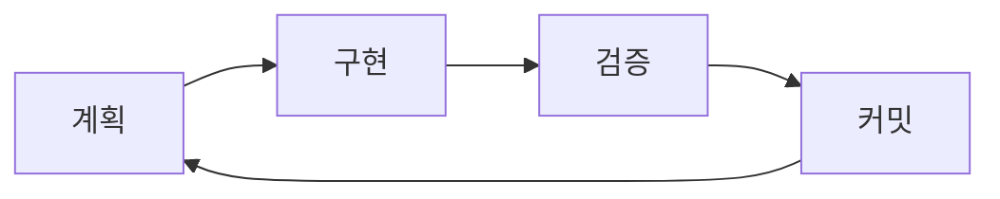
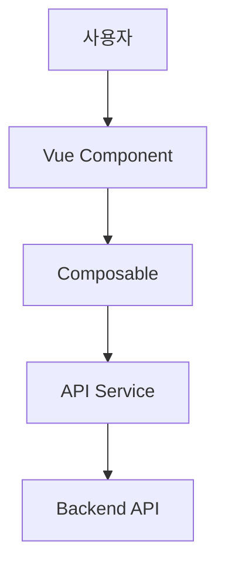

# 핵심 원칙 (Core Principles)

## TL;DR

- [ ] SSOT: 정보의 원본 위치가 명확한가?
- [ ] MECE: 중복 없이 빠짐없이 분류했는가?
- [ ] SoC: 모듈이 단일 책임을 갖는가?
- [ ] 원자적 커밋: 커밋 단독으로 빌드/테스트가 성공하는가?
- [ ] 점진적 진행: 작은 단계로 분할하고 각 단계를 검증했는가?
- [ ] Success Criteria First: 성공 기준을 먼저 정의했는가?
- [ ] **파괴적 작업 확인**: 파일 삭제/코드 제거 전 사용자에게 확인받았는가?

---

## 1. SSOT (Single Source of Truth)

> "진실은 하나의 장소에만 존재해야 한다"

### 원칙

- 모든 정보는 **단 하나의 원본 위치**에만 존재
- 다른 곳에서는 원본을 **참조(링크)**
- 중복 정보는 **불일치의 원인**

### 적용 예시

| 상황 | 잘못된 방식 | 올바른 방식 |
|------|-------------|-------------|
| API 타입 정의 | 여러 파일에 동일 interface | `models/` 폴더에 정의 후 import |
| 상수 값 | 컴포넌트마다 하드코딩 | `constants/` 폴더에 정의 |
| 스타일 변수 | 각 컴포넌트에 직접 작성 | SCSS 변수로 정의 |
| 설정 정보 | 코드 내 하드코딩 | `.env` 또는 설정 파일 |

### 체크리스트

- [ ] 이 정보가 다른 곳에 이미 있는가?
- [ ] 원본 위치가 명확한가?
- [ ] 참조 시 링크가 정확한가?

---

## 2. MECE (Mutually Exclusive, Collectively Exhaustive)

> "겹치지 않고, 빠짐없이"

### 원칙

- **상호 배타적 (ME)**: 각 분류가 서로 겹치지 않음
- **전체 포괄적 (CE)**: 모든 케이스를 빠짐없이 커버

### 적용 예시

- **상태 표현**: Discriminated Union으로 MECE하게 정의 → [basic-coding.instructions.md](basic-coding.instructions.md#typescript-베스트-프랙티스) 참조
- **디렉토리 구조**: 명확한 기준으로 폴더 분류 → [project-architecture.instructions.md](project-architecture.instructions.md) 참조

### 체크리스트

- [ ] 기존 분류와 겹치는 부분이 있는가?
- [ ] 빠진 케이스가 있는가?
- [ ] 분류 기준이 일관적인가?

---

## 3. SoC (Separation of Concerns)

> "각 모듈은 하나의 관심사만 담당한다"

### 원칙

- 하나의 파일/함수/컴포넌트는 **하나의 책임**만 가짐
- 변경 이유가 **하나**여야 함 (Single Responsibility)
- 500줄 초과 시 **분할 검토** 필수

### Vue 프로젝트에서의 SoC

| 레이어 | 책임 |
|--------|------|
| **Component** | UI 렌더링, 사용자 상호작용 |
| **Composable** | 재사용 가능한 로직 |
| **Service** | API 통신 |
| **Store** | 전역 상태 관리 |
| **Model** | 타입 정의 |

→ 상세 패턴: [basic-coding.instructions.md](basic-coding.instructions.md)

### 체크리스트

- [ ] 이 모듈이 하나의 책임만 갖는가?
- [ ] 변경 이유가 하나인가?
- [ ] 500줄 초과 시 분할 검토했는가?

---

## 4. 원자적 커밋 (Atomic Commits)

> "각 커밋은 독립적으로 완결되어야 한다"

### 원칙

- 커밋 단독으로 **빌드 성공**
- 커밋 단독으로 **테스트 통과**
- **하나의 논리적 변경**만 포함
- 쉽게 **되돌리기 가능**

### 좋은 예 vs 나쁜 예

```bash
# 좋은 예: 각 커밋이 독립적
feat(auth): Add LoginForm component
feat(auth): Add login API service
feat(auth): Add useAuth composable
feat(auth): Connect LoginForm to API

# 나쁜 예: 여러 변경이 하나의 커밋에
feat(auth): Add login feature with form, API, composable, store, and tests
```

### 체크리스트

- [ ] 이 커밋만으로 빌드가 성공하는가?
- [ ] 이 커밋만으로 테스트가 통과하는가?
- [ ] 하나의 목적만 담고 있는가?
- [ ] 커밋 메시지가 "무엇을 왜" 설명하는가?

→ 상세 규칙: [commit.instructions.md](commit.instructions.md)

---

## 5. 점진적 진행 (Incremental Progress)

> "큰 작업을 작은 검증 가능한 단계로 분할한다"

### 원칙

- 작업을 **작은 단계**로 분할
- 각 단계마다 **검증**
- 다음 단계 전 현재 단계 **완료**

### 실천 방법



### 예시: 새 기능 구현

1. **타입 정의** → 컴파일 확인
2. **API 서비스** → 네트워크 테스트
3. **Store 액션** → 상태 변경 확인
4. **Composable** → 로직 테스트
5. **Component** → UI 렌더링 확인
6. **통합 테스트** → E2E 검증

### 체크리스트

- [ ] 작업을 작은 단계로 분할했는가?
- [ ] 각 단계마다 검증했는가?
- [ ] 다음 단계 전에 현재 단계를 완료했는가?

---

## 6. Success Criteria First

> "무엇이 성공인지 먼저 정의한다"

### 원칙

- 구현 전 **성공 기준** 정의
- 성공 기준은 **측정 가능**해야 함
- 기준을 **문서에 기록**

### 예시

```markdown
## 성공 기준
- [ ] 사용자가 로그인 폼에 이메일/비밀번호 입력 가능
- [ ] 유효하지 않은 입력 시 에러 메시지 표시
- [ ] 로그인 성공 시 대시보드로 리다이렉트
- [ ] 로그인 실패 시 에러 토스트 표시
- [ ] 로딩 중 버튼 비활성화
```

### 체크리스트

- [ ] 성공 기준을 먼저 작성했는가?
- [ ] 성공 기준이 측정 가능한가?
- [ ] 성공 기준을 문서에 기록했는가?

---

## 7. 머메이드 차트 활용

> "복잡한 관계는 시각화한다"

### 원칙

- 텍스트로 설명이 어려운 관계/흐름은 **머메이드 차트** 사용
- 노드 라벨에 `1.`, `2.` 등 **숫자 사용 금지** (렌더링 오류 방지)

### 활용 상황

| 상황 | 차트 유형 |
|------|-----------|
| 데이터 흐름 | `graph LR/TD` |
| 상태 전이 | `stateDiagram-v2` |
| 시퀀스 | `sequenceDiagram` |
| 클래스 관계 | `classDiagram` |

### 예시



### 체크리스트

- [ ] 복잡한 관계/흐름을 텍스트로만 설명하고 있는가?
- [ ] 노드 라벨에 숫자를 사용하지 않았는가?

---

## 8. 파괴적 작업 확인 (Destructive Action Confirmation)

> "삭제/제거 작업은 반드시 사용자 확인 후 진행한다"

### 원칙

- **파일 삭제** 전 반드시 사용자에게 확인
- **코드 블록 제거** 전 반드시 사용자에게 확인
- **대량 수정** 시 영향 범위 먼저 안내

### 확인이 필요한 작업

| 작업 유형 | 예시 |
|----------|------|
| 파일 삭제 | `.vue`, `.ts` 파일 삭제 |
| 폴더 삭제 | `components/`, `pages/` 폴더 제거 |
| 코드 블록 제거 | 함수, 컴포넌트, 클래스 삭제 |
| 대량 리팩토링 | 여러 파일에 걸친 구조 변경 |
| 의존성 제거 | `package.json`에서 패키지 삭제 |

### 확인 형식

```markdown
⚠️ **삭제 확인 필요**

다음 항목을 삭제하려고 합니다:
- `src/components/OldComponent.vue`
- `src/composables/useDeprecated.ts`

**영향 범위**:
- 이 파일들을 import하는 곳: 3곳
- 관련 테스트: 2개

삭제를 진행할까요? (Y/N)
```

### 체크리스트

- [ ] 삭제/제거 작업 전 사용자에게 확인받았는가?
- [ ] 영향 범위를 안내했는가?
- [ ] 되돌리기 방법을 알려줬는가? (git restore 등)

---

## 원칙 적용 우선순위

문제 상황에서 원칙이 충돌할 때:

1. **타입 안전성** > 코드 간결성
2. **명확성** > 성능 (조기 최적화 금지)
3. **일관성** > 개인 선호
4. **테스트 가능성** > 구현 편의성

---

## 참고 자료

- [SOLID 원칙](https://en.wikipedia.org/wiki/SOLID)
- [MECE 원칙](https://en.wikipedia.org/wiki/MECE_principle)
- [Separation of Concerns](https://en.wikipedia.org/wiki/Separation_of_concerns)
- [Atomic Commits](https://www.aleksandrhovhannisyan.com/blog/atomic-git-commits/)
