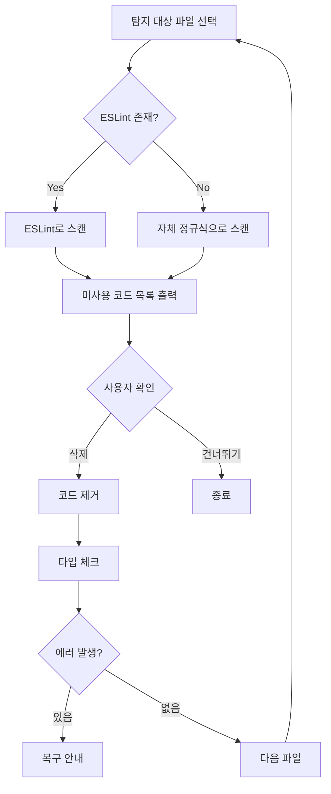

# Code Cleaner

미사용 코드와 디버그 코드를 탐지하고 안전하게 제거하는 스킬.

## 핵심 원칙

- **파괴적 작업 확인**: 삭제 전 반드시 사용자 확인 → [core-principles.instructions.md](../../instructions/core-principles.instructions.md#8-파괴적-작업-확인-destructive-action-confirmation)
- **점진적 진행**: 파일 단위로 검증하며 진행
- **타입 체크**: 삭제 후 반드시 빌드/타입 체크

## 탐지 대상

| 항목 | 탐지 방법 |
|------|----------|
| 미사용 함수 | (1) ESLint 활용 (우선), (2) 자체 분석 (fallback) |
| 미사용 변수 | (1) ESLint no-unused-vars (우선), (2) 자체 정규식 분석 (fallback) |
| 미사용 import | (1) ESLint (우선), (2) 자체 정규식 분석 (fallback) |
| console.log | grep 검색, 주석 내 제외 |
| 미사용 컴포넌트 | 파일명 검색, import 확인 |

## 워크플로우



## 실행 단계

### Step 1: ESLint 확인

프로젝트에 ESLint가 설정되어 있는지 확인:

```bash
# ESLint 설정 파일 확인
file_search(query="**/eslint.config.*")

# package.json에서 lint 스크립트 확인
read_file(filePath="package.json")
```

### Step 2: 대상 파일 선택

사용자가 특정 파일/디렉토리를 지정하지 않으면:

```
components/
composables/
store/
helper/
api/
pages/
```

### Step 3: 미사용 코드 스캔

#### 3.1 console.log 탐지

```bash
grep_search(query="console\.log", isRegexp=true, includePattern="**/*.{ts,js,vue}")
```

**제외 패턴**:
- 주석 내: `// console.log`
- 문자열 내: `"console.log"`

#### 3.2 미사용 import 탐지

**전략 1: ESLint 사용 (우선)**

```bash
npm run lint -- --format json
```

**전략 2: 자체 분석 (ESLint 없을 때)**

1. import 문 추출
2. 각 import된 식별자가 파일 내에서 사용되는지 확인
3. 사용 횟수가 1회 (import 선언만)인 경우 → 미사용 의심

**Nuxt 3 주의사항**:
- Vue Composition API (`ref`, `computed` 등)는 자동 import되므로 명시적 import 불필요
- `components/` 폴더의 컴포넌트도 자동 import

#### 3.3 미사용 변수/함수 탐지

**전략 1: ESLint 사용 (우선)**

```bash
npm run lint -- --format json
```

**전략 2: 자체 패턴 분석**

1. 변수/함수 선언 추출
2. 파일 내 사용 횟수 확인
3. 선언만 있고 사용 없음 → 미사용 의심

**제외 대상**:
- `_`로 시작하는 변수 (의도적 미사용)
- `definePageMeta`, `defineNuxtConfig` 등 Nuxt 매크로

### Step 4: 심각도 분류

| 심각도 | 항목 | 액션 |
|--------|------|------|
| 🔴 High | console.log | 즉시 제거 권장 |
| 🟡 Medium | 미사용 import | 확인 후 제거 |
| 🟢 Low | 미사용 변수 | 검토 후 결정 |

### Step 5: 사용자 확인

```markdown
⚠️ **미사용 코드 발견**

**console.log** (3건):
- `components/quiz/QuizCard.vue:45` - `console.log('debug')`
- `store/quiz.store.ts:78` - `console.log(data)`

**미사용 import** (2건):
- `pages/quiz/index.vue:3` - `computed` (Nuxt 3 자동 import로 불필요)

삭제를 진행할까요? (Y/N)
```

### Step 6: 코드 제거 및 검증

```bash
# 수정 후 타입 체크
npm run typecheck

# 린트 확인
npm run lint
```

**실패 시**:
```markdown
❌ 검증 실패

롤백: `git restore <file-path>`
```

## Nuxt 3 특이사항

### 자동 Import로 인한 미사용 import

Nuxt 3는 다음을 자동 import합니다:

| 카테고리 | 예시 |
|----------|------|
| Vue API | `ref`, `computed`, `watch`, `onMounted` |
| Vue Router | `useRoute`, `useRouter` |
| Nuxt Composables | `useHead`, `useFetch`, `useAsyncData` |
| Components | `components/` 폴더 내 모든 컴포넌트 |

따라서 이러한 항목들의 명시적 import는 제거해도 됩니다.

### 제거하면 안 되는 import

| 항목 | 이유 |
|------|------|
| 타입 import (`type { ... }`) | 런타임에 없지만 타입 체크 필요 |
| Pinia stores | 자동 import 아님 |
| 외부 라이브러리 | 자동 import 아님 |
| `@/models/*` | 자동 import 아님 |
| `@/helper/*` | 자동 import 아님 |

## 도구

- `grep_search`: 코드 패턴 검색
- `read_file`: 파일 내용 확인
- `replace_string_in_file`: 코드 수정
- `get_errors`: 타입 에러 확인
- `run_in_terminal`: 린트/타입체크 실행
