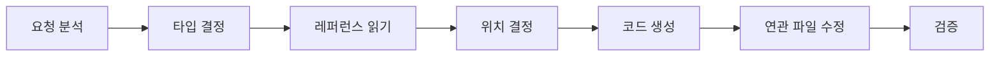

# Code Generator

Nuxt 3 + TypeScript 코드 생성 스킬.

## 워크플로우



### ⚠️ 레퍼런스 참조 필수

코드 생성 전 반드시 해당 타입의 레퍼런스 파일을 `read_file`로 읽어야 한다.
레퍼런스에 네이밍, 패턴, 템플릿이 정의되어 있으므로 **추측하지 말고 참조할 것.**

| 생성 대상 | 반드시 읽을 레퍼런스 |
|-----------|---------------------|
| 모달/다이얼로그 | `references/modal.md` |
| 셀렉터 | `references/selector.md` |
| Input 컴포넌트 | `references/input.md` |
| 테이블 (q-table) | `references/table.md` |
| 기본 컴포넌트 | `references/component.md` |
| 페이지 | `references/page.md` |
| Composable | `references/composable.md` |
| Helper | `references/helper.md` |
| **SCSS 스타일** | `references/scss.md` |

### ⚠️ 기존 헬퍼 활용 필수

코드 생성 시 **반드시 `references/helper.md`의 기존 헬퍼 맵을 확인**하고, 이미 존재하는 함수를 사용할 것.

자주 사용하는 헬퍼 (빠른 참조):

| 상황 | 사용할 헬퍼 | import |
|------|------------|--------|
| 통화 포맷 | `Filters.currency` | `@/helper/filters` |
| 숫자 포맷 | `Filters.numberFormat` | `@/helper/filters` |
| 날짜 표시 | `getDisplayTime` | `@/helper/utc-date` |
| 토스트/확인 | `ToastMessage`, `ConfirmMessage` | `@/helper/message` |
| 부동소수점 계산 | `calc`, `floorTo` | `@/helper/float` |

## 생성 타입

| 타입 | 트리거 | 위치 |
|------|--------|------|
| Component | "컴포넌트", "모달", "셀렉터" | `components/` |
| Page | "페이지", "뷰" | `pages/` |
| Composable | "Composable", "훅" | `composables/` |
| Helper | "헬퍼", "유틸" | `helper/` |
| Store | "스토어", "상태" | `store/` |
| API | "API", "서비스" | `api/` 또는 `server/api/` |

## 생성 전 질문

1. **이름**: 생성할 대상의 이름?
2. **도메인**: 어떤 도메인에 속하는가? (quiz, ranking, badge 등)

## 코드 품질 기준

→ [basic-coding.instructions.md](../../instructions/basic-coding.instructions.md)

## 생성 후 필수 작업

1. **타입 체크**: `npm run typecheck`
2. **린트**: `npm run lint`
3. **연관 파일 수정**: index.ts 등
4. **헬퍼 추가 시**: `references/helper.md`의 기존 헬퍼 맵 테이블에 새 함수 추가
5. **커밋 메시지 제안**

---

## 영역별 가이드

### Component

| 유형 | 레퍼런스 |
|------|----------|
| 기본 컴포넌트 | [references/component.md](references/component.md) |
| 모달/다이얼로그 | [references/modal.md](references/modal.md) |
| 셀렉터 | [references/selector.md](references/selector.md) |
| Input | [references/input.md](references/input.md) |

### Page

→ [references/page.md](references/page.md)

Nuxt 3는 파일 기반 라우팅을 사용합니다:
- `pages/index.vue` → `/`
- `pages/quiz/index.vue` → `/quiz`
- `pages/quiz/[id].vue` → `/quiz/:id`

### Composable

→ [references/composable.md](references/composable.md)

### Helper

→ [references/helper.md](references/helper.md)

---

## 네이밍 규칙 요약

### 자기 설명적 네이밍 (필수)

파일명만 보고 **도메인 + 역할**을 알 수 있어야 한다. 도메인/컨텍스트 없는 이름은 금지.

```
❌ DialogDownload.vue         → 무엇의 다운로드인지 모름
✅ QuizResultDownload.vue     → Quiz Result 다운로드

❌ SelectorMulti.vue          → 무엇의 멀티셀렉터인지 모름
✅ CategoryMultiSelector.vue  → Category 멀티셀렉터

❌ use-validate.ts            → 무엇을 검증하는지 모름
✅ use-validate-quiz-form.ts  → Quiz Form 검증
```

### 파일명 규칙

| 대상 | 규칙 | 예시 |
|------|------|------|
| 컴포넌트 파일 | PascalCase | `QuizCard.vue` |
| 모달/다이얼로그 | `{도메인}{동작}Dialog` | `QuizCreateDialog.vue` |
| 셀렉터 | `{도메인}Selector` | `CategorySelector.vue` |
| 페이지 파일 | kebab-case | `quiz-list.vue`, `[id].vue` |
| Composable | `use-{도메인}-{동작}` (kebab-case) | `use-quiz-form.ts` |
| Helper | camelCase | `formatDate.ts`, `validation.ts` |
| Store | `{도메인}.store.ts` | `quiz.store.ts` |

## 폴더 구조

```
GoGoQuizKing/
├── components/
│   ├── quiz/           # 퀴즈 관련 컴포넌트
│   ├── ranking/        # 랭킹 관련 컴포넌트
│   ├── badge/          # 뱃지 관련 컴포넌트
│   ├── layout/         # 레이아웃 컴포넌트
│   └── input/          # 공통 입력 컴포넌트
├── pages/
│   ├── index.vue       # 홈
│   ├── quiz/           # 퀴즈 페이지들
│   ├── ranking/        # 랭킹 페이지들
│   └── profile/        # 프로필 페이지들
├── composables/        # Composables
├── store/              # Pinia stores
├── helper/             # 유틸리티 함수
├── models/             # TypeScript 타입 정의
├── api/                # API 클라이언트
└── server/api/         # Nuxt Server API Routes
```

→ [project-architecture.instructions.md](../../instructions/project-architecture.instructions.md) 참조

## 공통 패턴

### ⚠️ UI 컬러 기본값 (필수)

**코드 생성 시 모든 UI 요소에 `color="primary"`를 반드시 명시한다.**

| 요소 | 필수 속성 | 예시 |
|------|----------|------|
| `q-btn` | `color="primary"` | `<q-btn color="primary" label="Save" />` |
| `q-checkbox` | `color="primary"` | `<q-checkbox v-model="checked" color="primary" />` |

**예외 케이스**:
| 버튼 용도 | 컬러 |
|----------|------|
| Cancel / 취소 | `color="grey"` |
| Delete / 삭제 | `color="negative"` |

### Nuxt 3 Auto-Import

Nuxt 3는 다음을 자동으로 import합니다:
- Vue Composition API (`ref`, `computed`, `watch` 등)
- Composables (`useRoute`, `useRouter`, `useState` 등)
- `components/` 폴더의 컴포넌트

```vue
<script setup lang="ts">
// ✅ 자동 import - 별도 import 문 불필요
const route = useRoute();
const count = ref(0);

// ❌ 수동 import 필요
import { useQuizStore } from '@/store/quiz.store';
import type { IQuiz } from '@/models/quiz';
</script>
```

### definePageMeta (페이지 설정)

```vue
<script setup lang="ts">
definePageMeta({
    layout: 'default',
    middleware: ['auth-guard'],
});
</script>
```
