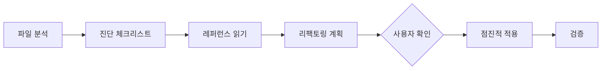

# Code Refactorer

기존 코드를 프로젝트 코딩 가이드에 맞게 리팩토링하는 스킬.

## 다른 스킬과의 경계

| 스킬 | 범위 | 이 스킬과의 차이 |
|------|------|-----------------|
| code-cleaner | 미사용 코드 **제거** | 리팩토링은 코드를 **개선** (구조 변경, 패턴 적용) |
| code-reorderer | 코드 **순서** 재배치 | 리팩토링은 코드 **구조/패턴** 자체를 변경 |
| code-generator | 새 코드 **생성** | 리팩토링은 **기존** 코드를 개선 |

## 워크플로우



### Step 1: 파일 분석 (필수)

대상 파일을 `read_file`로 읽고 현재 상태를 파악한다.

**확인 항목**:
- 파일 타입 (.vue / .ts / .js)
- 파일 길이 (500줄 초과 시 분할 후보)
- 사용된 패턴 (Options API / Composition API 등)
- 파일 위치 (경로로 유형 판단)

### Step 2: 문제 진단 (필수)

**반드시 `read_file`로 진단 체크리스트를 읽고** 개선점을 식별한다.

```
read_file: .github/skills/code-refactorer/references/diagnosis-checklist.md
```

### Step 3: 레퍼런스 참조 (필수)

**반드시 `read_file`로 해당 레퍼런스를 읽는다.** 파일 경로로 유형을 판단한다.

| 파일 경로 패턴 | 파일 유형 | 참조할 레퍼런스 |
|---------------|-----------|----------------|
| `components/**/*.vue` | 컴포넌트 | `.github/skills/code-generator/references/component.md` |
| `pages/**/*.vue` | 페이지 | `.github/skills/code-generator/references/page.md` |
| `composables/**/*.ts` | Composable | `.github/skills/code-generator/references/composable.md` |
| `helper/**/*.ts` | Helper | `.github/skills/code-generator/references/helper.md` |
| `store/**/*.ts` | Pinia Store | basic-coding.instructions.md 참조 |
| `models/**/*.ts` | 타입/인터페이스 | basic-coding.instructions.md 참조 |

### Step 4: 리팩토링 계획 (필수)

**반드시 사용자에게 변경 계획을 제시하고 확인받는다.**

```markdown
## 리팩토링 계획

**대상**: `components/quiz/QuizCard.vue` (320줄)

| # | 개선 항목 | 설명 |
|---|----------|------|
| 1 | 로직 추출 | API 호출 로직 → `useQuizData.ts` Composable로 분리 |
| 2 | 타입 강화 | `any` 3건 → 구체적 타입으로 변경 |
| 3 | 패턴 교정 | emit 대신 props 직접 변경 → emit 패턴으로 수정 |

진행할까요?
```

### Step 5: 점진적 적용

한 번에 하나의 개선 항목만 적용하고, 매번 `get_errors`로 검증한다.

### Step 6: 검증 (필수)

```bash
# IDE 에러 확인
get_errors: [대상 파일]

# 타입 체크
npm run typecheck

# 린트
npm run lint
```

## 리팩토링 카테고리

### A. 구조 리팩토링

| 항목 | 트리거 | 적용 |
|------|--------|------|
| 컴포넌트 분리 | 500줄 초과, 다중 책임 | 작은 컴포넌트로 분할 |
| 로직 추출 | 재사용 가능한 로직 | Composable로 분리 |
| 헬퍼 추출 | 순수 함수 반복 | helper/로 이동 |
| Store 분리 | Store 비대화 | 도메인별 Store 분할 |

### B. 패턴 리팩토링

| 항목 | Before | After |
|------|--------|-------|
| Options → Composition | `export default { data(), methods }` | `<script setup lang="ts">` |
| Props 직접 변경 | `props.value = x` | `emit('update', x)` |
| v-model 패턴 | 수동 emit | `defineModel()` |

### C. 타입 안전성 강화

| 항목 | Before | After |
|------|--------|-------|
| `any` 제거 | `any` | `unknown` + 타입 가드, 또는 구체적 타입 |
| 타입 명시 | 추론 불가능한 곳 | 명시적 타입 선언 |
| Props 타입 | runtime 검증 | TypeScript 제네릭 |

### D. 기존 헬퍼 활용

리팩토링 시 반드시 기존 헬퍼 존재 여부를 확인한다.

→ [code-generator/references/helper.md](../code-generator/references/helper.md)

**자주 발견되는 패턴**:

| 인라인 코드 | 대체할 헬퍼 |
|------------|------------|
| `new Date().toLocaleString(...)` | `getDisplayTime(...)` |
| `Number(value).toFixed(2)` | `Filters.currency(...)` |

## Nuxt 3 특이사항

### 자동 Import 활용

리팩토링 시 Nuxt 3 자동 import를 활용하여 불필요한 import 제거:

```vue
<script setup lang="ts">
// ❌ Before: 불필요한 import
import { ref, computed, onMounted } from 'vue';
import { useRoute } from 'vue-router';

// ✅ After: 자동 import 활용 (import 문 제거)
const route = useRoute();
const count = ref(0);
</script>
```

### definePageMeta 사용

페이지 설정은 `definePageMeta`로:

```vue
<script setup lang="ts">
definePageMeta({
    layout: 'default',
    middleware: ['auth-guard'],
});
</script>
```

## 파괴적 작업 확인

→ [core-principles.instructions.md](../../instructions/core-principles.instructions.md#8-파괴적-작업-확인-destructive-action-confirmation)

다음 경우 반드시 사용자에게 확인:
- 컴포넌트 분리 (기존 파일 구조 변경)
- 함수/변수 이름 변경 (외부 참조 영향)
- 파일 이동/이름 변경

## 커밋 메시지

→ [commit.instructions.md](../../instructions/commit.instructions.md)

리팩토링 커밋 타입: `[Refactor]`
