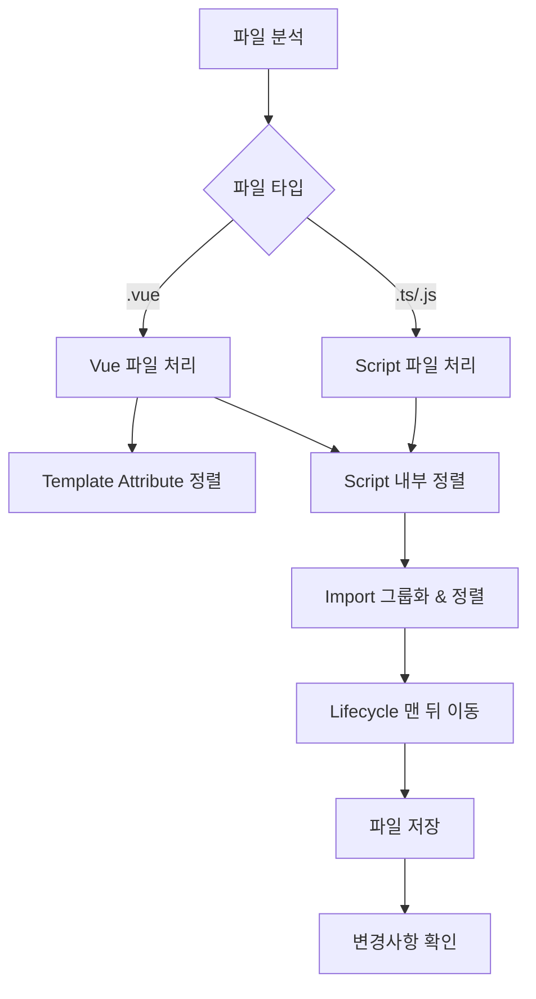

# Code Reorderer

파일 내 코드 요소의 순서를 일관성 있게 재배치합니다.

## 트리거 키워드

- "코드 순서 정리"
- "import 정리해줘"
- "attribute 순서 맞춰줘"
- "생명주기 함수 순서"
- "코드 재배치"

## 재배치 규칙

### 1. Vue 파일 구조 순서

```vue
<template>
  <!-- 1. 템플릿 -->
</template>

<script setup lang="ts">
// 2. 스크립트
</script>

<style scoped lang="scss">
/* 3. 스타일 */
</style>
```

### 2. Script 내부 순서 (Nuxt 3)

```typescript
// 1. Type imports (타입만)
import type { IQuiz } from '@/models/quiz';

// 2. External imports (외부 라이브러리)
import dayjs from 'dayjs';

// 3. Internal imports (프로젝트 내부 - 자동 import 아닌 것만)
import { useQuizStore } from '@/store/quiz.store';
import { formatDate } from '@/helper/utc-date';

// 4. definePageMeta (페이지만)
definePageMeta({
    layout: 'default',
    middleware: ['auth-guard'],
});

// 5. Props & Emits
const props = defineProps<{...}>();
const emit = defineEmits<{...}>();

// 6. Route & Store (Nuxt 자동 import)
const route = useRoute();
const router = useRouter();
const quizStore = useQuizStore();

// 7. Composables
const { user, loading } = useAuth();

// 8. Reactive State
const count = ref(0);
const list = ref<IQuiz[]>([]);

// 9. Computed
const filteredList = computed(() => ...);

// 10. Watch
watch(count, (newVal) => {...});

// 11. Methods
function handleSubmit() {...}
async function fetchData() {...}

// 12. Lifecycle Hooks (마지막)
onMounted(() => {...});
onUnmounted(() => {...});
```

### 3. Import 그룹 순서 (Nuxt 3)

Nuxt 3는 Vue API, 컴포넌트, composables를 자동 import하므로 import 문이 적습니다.

**수동 import가 필요한 것들**:

1. **Type imports**: `type { IQuiz, IUser }`
2. **External libraries**: `dayjs`, `lodash-es`, `chart.js`
3. **Pinia stores**: `@/store/*.store`
4. **Models**: `@/models/*`
5. **Helpers**: `@/helper/*`
6. **API**: `@/api/*`

각 그룹 내에서는 **알파벳 순**으로 정렬.

### 4. Template Attribute 순서

```vue
<q-btn
  v-if="isVisible"
  v-show="!isHidden"
  v-for="item in items"
  @click="handleClick"
  @input="handleInput"
  :key="item.id"
  :label="item.name"
  :disable="isLoading"
  :class="{ active: isActive }"
  class="btn-primary"
  id="submit-btn"
  color="primary"
  unelevated
  dense
/>
```

**순서**:
1. **Directives**: `v-if`, `v-show`, `v-for`, `v-model`, `v-slot`
2. **Events**: `@click`, `@input`, `@change` (알파벳 순)
3. **Dynamic bindings**: `:key`, `:label`, `:props` (알파벳 순)
4. **Static attributes**: `class`, `id`, `name` (알파벳 순)
5. **Props**: `color`, `size`, `type`
6. **Boolean attributes**: `disabled`, `readonly`, `unelevated`, `dense` (알파벳 순)

### 5. Lifecycle Hooks 순서

```typescript
// Setup phase
onBeforeMount(() => {...});
onMounted(() => {...});

// Update phase
onBeforeUpdate(() => {...});
onUpdated(() => {...});

// Cleanup phase
onBeforeUnmount(() => {...});
onUnmounted(() => {...});

// Others
onActivated(() => {...});
onDeactivated(() => {...});
onErrorCaptured(() => {...});
```

## 실행 워크플로우



### Step 1: 파일 분석

```typescript
// 파일 타입 확인
if (filePath.endsWith('.vue')) {
  // Vue 컴포넌트
} else if (filePath.endsWith('.ts') || filePath.endsWith('.js')) {
  // TypeScript/JavaScript
}
```

### Step 2: 코드 블록 식별

```typescript
// 코드 블록 식별
- Import 구문
- definePageMeta (Nuxt 페이지)
- Props/Emits 정의
- Route/Store 선언
- Composables 사용
- Reactive state
- Computed properties
- Watch
- Methods
- Lifecycle hooks
```

### Step 3: 재배치 적용

1. Import 그룹 정렬
2. 코드 블록 순서 재배치
3. Lifecycle hooks를 마지막으로 이동

### Step 4: 검증

```bash
# IDE 에러 확인
get_errors: [대상 파일]

# 타입 체크
npm run typecheck
```

## Nuxt 3 특이사항

### 자동 Import 고려

다음은 import 문이 필요 없으므로 정리 대상:

| 카테고리 | 예시 |
|----------|------|
| Vue API | `ref`, `computed`, `watch`, `onMounted` |
| Vue Router | `useRoute`, `useRouter` |
| Nuxt Composables | `useHead`, `useFetch`, `useAsyncData`, `useRuntimeConfig` |
| Components | `components/` 폴더 내 모든 컴포넌트 |

### definePageMeta 위치

페이지 파일에서 `definePageMeta`는 import 바로 다음에 위치:

```vue
<script setup lang="ts">
import type { IQuiz } from '@/models/quiz';

definePageMeta({
    layout: 'default',
});

// 나머지 코드...
</script>
```

## 도구

- `read_file`: 파일 내용 확인
- `replace_string_in_file`: 코드 재배치
- `get_errors`: 변경 후 검증
