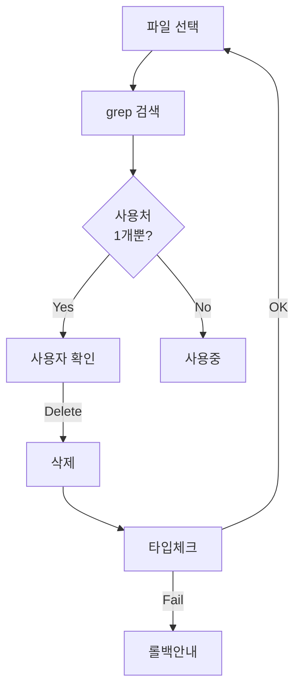

# File Cleaner

프로젝트에서 사용되지 않는 파일을 찾아 안전하게 정리합니다.

**핵심**: 안전 우선 → 사용자 확인 → 삭제 → 검증 → 연쇄 검색

## 워크플로우



## 검색 대상

```
components/
composables/
pages/
store/
helper/
api/
models/
```

**제외**: `*.spec.ts`, `*.test.ts`, `*.d.ts`, `nuxt.config.ts`, `tsconfig.json`, `app.vue`, `app.config.ts`

## 실행 방법

### 1. 파일 사용처 검색

```typescript
// 예: QuizCard.vue가 어디서 사용되는지 확인
grep_search(query: "QuizCard", includePattern: "**/*.{vue,ts,js}")
```

**판단**:
- 결과 1개 (자기 자신만) → 고립 파일 ✅
- 결과 2개 이상 → 사용 중 ❌

### 2. Nuxt 3 특이사항

Nuxt 3는 `components/` 폴더의 컴포넌트를 자동 import합니다.
따라서 **명시적 import 문이 없어도 템플릿에서 사용 중일 수 있습니다.**

```typescript
// 컴포넌트 사용 확인: 파일명과 태그명 모두 검색
grep_search(query: "<QuizCard", includePattern: "**/*.vue")
grep_search(query: "<quiz-card", includePattern: "**/*.vue")
```

**kebab-case 변환 고려**:
- `QuizCard.vue` → `<QuizCard>` 또는 `<quiz-card>`

### 3. 사용자 확인

```markdown
⚠️ **미사용 파일 발견**

- [ ] components/old/OldComponent.vue
- [ ] helper/deprecated-util.ts

삭제하시겠습니까? (Y/N)
```

### 4. 삭제

```bash
rm components/old/OldComponent.vue
```

### 5. 검증

```bash
npm run typecheck
```

**실패 시**:
```markdown
❌ 검증 실패

오류:
- pages/quiz/index.vue(45): Cannot find module...

롤백: `git restore <file-path>`
```

**성공 시**: Step 1로 돌아가 연쇄 검색 (방금 삭제한 파일만 사용하던 다른 파일 찾기)

## 예시

### 단순 고립

```
1. UnusedPage.vue 검색 → 사용처 없음
2. 확인 → 삭제
3. 타입체크 성공
4. 재검색 → 추가 없음
```

### 연쇄 고립

```
1. OldComponent.vue 검색 → 사용처 없음
2. 삭제 → 타입체크 성공
3. 재검색 → useOldLogic.ts 발견 (OldComponent만 사용)
4. 삭제 → 타입체크 성공
5. 재검색 → 추가 없음
```

### 잘못된 삭제

```
1. QuizCard.vue 삭제 (템플릿에서 <quiz-card>로 사용 중인 것 놓침)
2. 타입체크 실패
3. git restore로 복구
```

## Nuxt 3 자동 Import 고려사항

### 컴포넌트

`components/` 폴더의 컴포넌트는 자동 등록됩니다:

| 경로 | 사용 가능한 이름 |
|------|-----------------|
| `components/QuizCard.vue` | `<QuizCard>`, `<quiz-card>` |
| `components/quiz/QuizCard.vue` | `<QuizQuizCard>`, `<quiz-quiz-card>` |

### Composables

`composables/` 폴더의 composable은 자동 import됩니다:

| 경로 | 사용 가능한 이름 |
|------|-----------------|
| `composables/useAuth.ts` | `useAuth()` |
| `composables/use-quiz-form.ts` | `useQuizForm()` |

### 검색 시 주의

자동 import로 인해 import 문이 없어도 사용 중일 수 있으므로:

1. 컴포넌트: 태그 이름으로 검색 (PascalCase + kebab-case)
2. Composable: 함수 이름으로 검색 (호출부)

## 주의사항

- **동적 import**: 문자열 템플릿으로 생성된 import는 감지 못할 수 있음
- **런타임 의존성**: 코드상 import 없어도 런타임에 필요한 파일 존재
- **완벽한 탐지 불가능**: 최종 판단은 사용자 몫
- **Nuxt 자동 import**: 명시적 import 없이 사용되는 경우 주의

## 도구

- `grep_search`: 파일 사용처 검색
- `run_in_terminal`: 파일 삭제, 타입 체크
- `get_errors`: 타입 에러 확인
