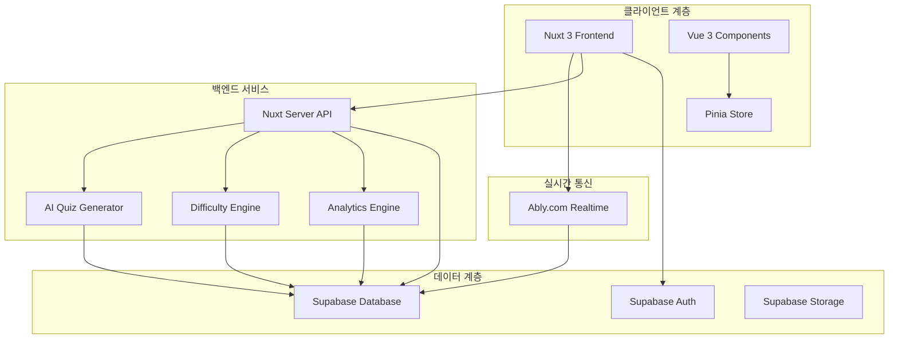
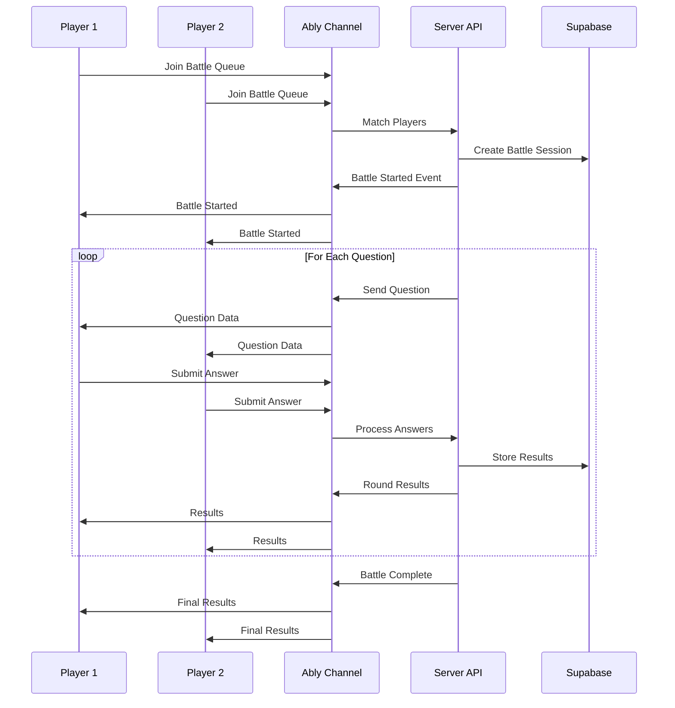

# 설계 문서

## 개요

AI 기반 퀴즈 플랫폼은 Nuxt 3, Supabase, Ably.com을 활용한 실시간 멀티플레이어 퀴즈 시스템입니다. 시스템은 AI를 통한 동적 퀴즈 생성, 실시간 1:1 대결, 적응형 난이도 조정, 성과 분석 및 학습 추천 기능을 제공합니다.

## 아키텍처

### 전체 시스템 아키텍처



### 실시간 대결 플로우



## 컴포넌트 및 인터페이스

### 핵심 컴포넌트

#### 1. AI 퀴즈 생성기 (AI Quiz Generator)
- **목적**: 카테고리별 퀴즈 자동 생성
- **위치**: `~/server/api/quiz/generate.ts`
- **기능**:
  - OpenAI/Claude API 통합
  - 카테고리별 질문 생성
  - 난이도 조정
  - 질문 검증 및 저장

#### 2. 실시간 대결 매니저 (Battle Manager)
- **목적**: 1:1 퀴즈 대결 관리
- **위치**: `~/components/quiz/BattleManager.vue`
- **기능**:
  - 플레이어 매칭
  - 실시간 상태 동기화
  - 점수 계산
  - 연결 해제 처리

#### 3. 난이도 조정 엔진 (Difficulty Engine)
- **목적**: 사용자별 맞춤 난이도 조정
- **위치**: `~/server/api/user/difficulty.ts`
- **기능**:
  - 성과 분석
  - 난이도 알고리즘
  - 진행 상황 추적

#### 4. 분석 및 추천 시스템 (Analytics & Recommendation)
- **목적**: 성과 분석 및 학습 추천
- **위치**: `~/server/api/analytics/`
- **기능**:
  - 성과 패턴 분석
  - 지식 격차 식별
  - 개인화된 추천

### 주요 Vue 컴포넌트

```typescript
// ~/components/quiz/QuizBattle.vue
interface QuizBattleProps {
  battleId: string;
  playerId: string;
  opponentId: string;
}

// ~/components/quiz/QuestionCard.vue
interface QuestionCardProps {
  question: QuizQuestion;
  timeLimit: number;
  onAnswer: (answer: string, timeSpent: number) => void;
}

// ~/components/quiz/Leaderboard.vue
interface LeaderboardProps {
  category?: string;
  timeRange: 'daily' | 'weekly' | 'monthly' | 'all';
}
```

## 데이터 모델

### Supabase 테이블 구조

#### 1. quiz_questions 테이블
```sql
CREATE TABLE quiz_questions (
  id UUID PRIMARY KEY DEFAULT gen_random_uuid(),
  category VARCHAR(50) NOT NULL,
  question TEXT NOT NULL,
  correct_answer TEXT NOT NULL,
  incorrect_answers TEXT[] NOT NULL,
  difficulty_level INTEGER NOT NULL DEFAULT 1,
  tags TEXT[],
  ai_generated BOOLEAN DEFAULT true,
  created_at TIMESTAMP WITH TIME ZONE DEFAULT NOW(),
  updated_at TIMESTAMP WITH TIME ZONE DEFAULT NOW()
);
```

#### 2. quiz_battles 테이블
```sql
CREATE TABLE quiz_battles (
  id UUID PRIMARY KEY DEFAULT gen_random_uuid(),
  player1_id UUID REFERENCES auth.users(id),
  player2_id UUID REFERENCES auth.users(id),
  category VARCHAR(50) NOT NULL,
  status VARCHAR(20) DEFAULT 'waiting', -- waiting, active, completed, abandoned
  questions UUID[] NOT NULL,
  player1_score INTEGER DEFAULT 0,
  player2_score INTEGER DEFAULT 0,
  winner_id UUID REFERENCES auth.users(id),
  started_at TIMESTAMP WITH TIME ZONE,
  completed_at TIMESTAMP WITH TIME ZONE,
  created_at TIMESTAMP WITH TIME ZONE DEFAULT NOW()
);
```

#### 3. quiz_answers 테이블
```sql
CREATE TABLE quiz_answers (
  id UUID PRIMARY KEY DEFAULT gen_random_uuid(),
  battle_id UUID REFERENCES quiz_battles(id),
  question_id UUID REFERENCES quiz_questions(id),
  user_id UUID REFERENCES auth.users(id),
  selected_answer TEXT NOT NULL,
  is_correct BOOLEAN NOT NULL,
  response_time INTEGER NOT NULL, -- milliseconds
  answered_at TIMESTAMP WITH TIME ZONE DEFAULT NOW()
);
```

#### 4. user_profiles 테이블
```sql
CREATE TABLE user_profiles (
  id UUID PRIMARY KEY REFERENCES auth.users(id),
  username VARCHAR(50) UNIQUE NOT NULL,
  avatar_url TEXT,
  total_score INTEGER DEFAULT 0,
  battles_won INTEGER DEFAULT 0,
  battles_lost INTEGER DEFAULT 0,
  current_difficulty_level INTEGER DEFAULT 1,
  preferred_categories TEXT[],
  created_at TIMESTAMP WITH TIME ZONE DEFAULT NOW(),
  updated_at TIMESTAMP WITH TIME ZONE DEFAULT NOW()
);
```

#### 5. user_analytics 테이블
```sql
CREATE TABLE user_analytics (
  id UUID PRIMARY KEY DEFAULT gen_random_uuid(),
  user_id UUID REFERENCES auth.users(id),
  category VARCHAR(50) NOT NULL,
  correct_answers INTEGER DEFAULT 0,
  total_answers INTEGER DEFAULT 0,
  average_response_time INTEGER DEFAULT 0,
  difficulty_level INTEGER DEFAULT 1,
  last_updated TIMESTAMP WITH TIME ZONE DEFAULT NOW()
);
```

### TypeScript 인터페이스

```typescript
// ~/types/quiz.ts
export interface QuizQuestion {
  id: string;
  category: string;
  question: string;
  correctAnswer: string;
  incorrectAnswers: string[];
  difficultyLevel: number;
  tags: string[];
  aiGenerated: boolean;
  randomAnswers?: string[];
}

export interface QuizBattle {
  id: string;
  player1Id: string;
  player2Id: string;
  category: string;
  status: 'waiting' | 'active' | 'completed' | 'abandoned';
  questions: string[];
  player1Score: number;
  player2Score: number;
  winnerId?: string;
  startedAt?: Date;
  completedAt?: Date;
}

export interface UserProfile {
  id: string;
  username: string;
  avatarUrl?: string;
  totalScore: number;
  battlesWon: number;
  battlesLost: number;
  currentDifficultyLevel: number;
  preferredCategories: string[];
}

export interface UserAnalytics {
  userId: string;
  category: string;
  correctAnswers: number;
  totalAnswers: number;
  averageResponseTime: number;
  difficultyLevel: number;
  accuracy: number;
}
```

## 오류 처리

### 클라이언트 측 오류 처리

```typescript
// ~/composables/useErrorHandler.ts
export const useErrorHandler = () => {
  const handleQuizError = (error: Error, context: string) => {
    console.error(`Quiz Error in ${context}:`, error);
    
    // 사용자 친화적 메시지 표시
    const { $q } = useNuxtApp();
    $q.notify({
      type: 'negative',
      message: getErrorMessage(error),
      position: 'top'
    });
    
    // 오류 로깅
    logError(error, context);
  };
  
  const handleConnectionError = () => {
    // Ably 연결 오류 처리
    // 재연결 시도
    // 사용자에게 상태 알림
  };
  
  return {
    handleQuizError,
    handleConnectionError
  };
};
```

### 서버 측 오류 처리

```typescript
// ~/server/api/quiz/[...].ts
export default defineEventHandler(async (event) => {
  try {
    // API 로직
  } catch (error) {
    // 오류 로깅
    console.error('Quiz API Error:', error);
    
    // 적절한 HTTP 상태 코드 반환
    throw createError({
      statusCode: error.statusCode || 500,
      statusMessage: error.message || 'Internal Server Error'
    });
  }
});
```

### 실시간 연결 오류 처리

```typescript
// ~/composables/useAbly.ts
export const useAbly = () => {
  const handleConnectionFailure = () => {
    // 자동 재연결 시도
    // 사용자에게 연결 상태 알림
    // 오프라인 모드 활성화
  };
  
  const handleChannelError = (error: any) => {
    // 채널별 오류 처리
    // 대체 채널 사용
    // 상태 복구 시도
  };
};
```

## 테스트 전략

### 단위 테스트
- **도구**: Vitest, Vue Test Utils
- **대상**: 
  - Vue 컴포넌트 로직
  - Composables
  - 유틸리티 함수
  - API 엔드포인트

### 통합 테스트
- **도구**: Playwright, Cypress
- **대상**:
  - 실시간 대결 플로우
  - AI 퀴즈 생성 파이프라인
  - 사용자 인증 플로우
  - 데이터베이스 연동

### E2E 테스트
- **도구**: Playwright
- **시나리오**:
  - 완전한 퀴즈 대결 세션
  - 사용자 등록부터 첫 대결까지
  - 난이도 조정 시나리오
  - 분석 및 추천 기능

### 성능 테스트
- **도구**: Artillery, K6
- **대상**:
  - 동시 사용자 처리
  - 실시간 메시지 처리량
  - 데이터베이스 쿼리 성능
  - AI API 응답 시간

### 테스트 구조

```typescript
// ~/tests/components/QuizBattle.test.ts
describe('QuizBattle Component', () => {
  it('should handle real-time updates correctly', async () => {
    // 실시간 업데이트 테스트
  });
  
  it('should calculate scores accurately', () => {
    // 점수 계산 로직 테스트
  });
  
  it('should handle disconnection gracefully', async () => {
    // 연결 해제 처리 테스트
  });
});

// ~/tests/api/quiz-generation.test.ts
describe('Quiz Generation API', () => {
  it('should generate questions for specified category', async () => {
    // AI 퀴즈 생성 테스트
  });
  
  it('should adjust difficulty based on user level', async () => {
    // 난이도 조정 테스트
  });
});
```

## 보안 고려사항

### 인증 및 권한
- Supabase Auth를 통한 사용자 인증
- Row Level Security (RLS) 정책 적용
- JWT 토큰 기반 API 보안

### 데이터 보호
- 개인정보 암호화
- GDPR 준수
- 데이터 최소화 원칙

### 실시간 통신 보안
- Ably 채널 권한 관리
- 메시지 검증
- 스팸 방지 메커니즘

## 성능 최적화

### 클라이언트 최적화
- Vue 3 Composition API 활용
- 컴포넌트 지연 로딩
- 이미지 최적화 (Nuxt Image)
- 번들 크기 최적화

### 서버 최적화
- API 응답 캐싱
- 데이터베이스 쿼리 최적화
- CDN 활용
- 서버 사이드 렌더링 최적화

### 실시간 성능
- Ably 채널 최적화
- 메시지 배치 처리
- 연결 풀링
- 지역별 엣지 서버 활용