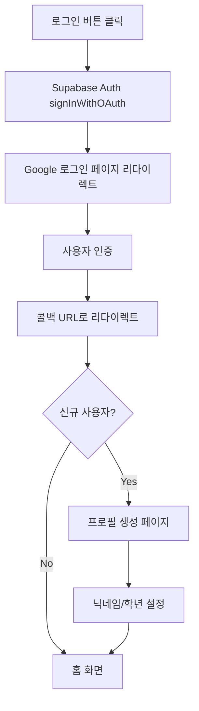
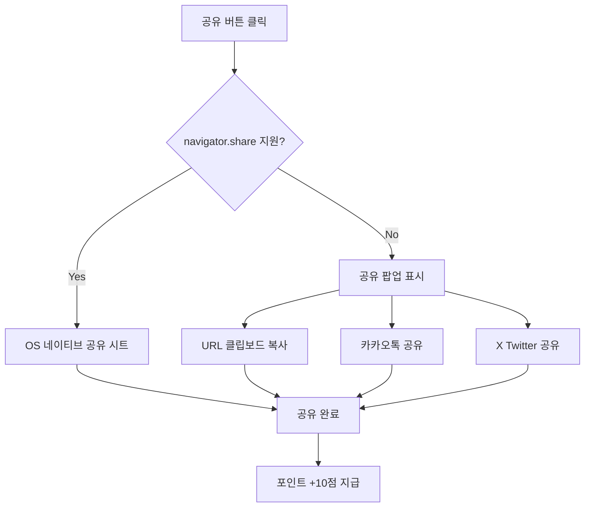
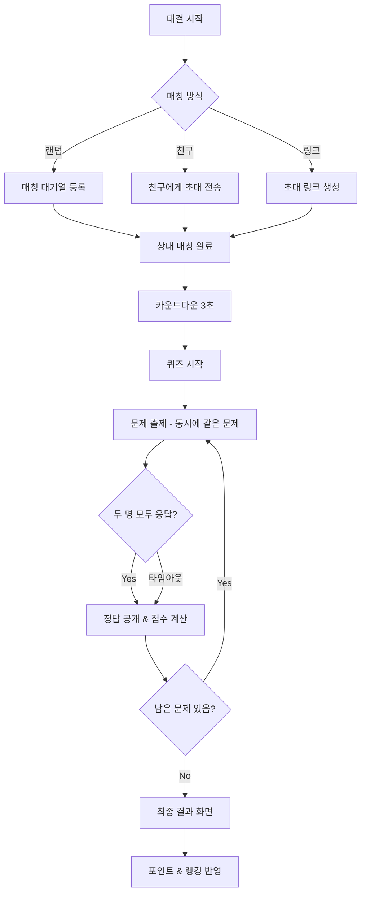

# 🎯 GoGoQuizKing 기획 문서

## 📋 프로젝트 개요

**GoGoQuizKing**은 초등학생(1~6학년)을 대상으로 한 재미있고 교육적인 퀴즈 커뮤니티 플랫폼입니다.

### 기술 스택
- **Frontend**: Nuxt.js 3, Quasar UI Framework
- **Backend**: Supabase (PostgreSQL, Auth, Realtime)
- **Language**: TypeScript
- **State Management**: Pinia

### 타겟 사용자
| 학년 | 연령 | 특징 |
|------|------|------|
| 1~2학년 | 7~8세 | 시각적 요소 중심, 간단한 문제 |
| 3~4학년 | 9~10세 | 기본 읽기/쓰기 가능, 다양한 과목 |
| 5~6학년 | 11~12세 | 복잡한 문제 해결, 경쟁 요소 선호 |

---

## 🎨 디자인 가이드라인

### 컬러 팔레트
```scss
// 메인 컬러 - 밝고 활기찬 느낌
$primary: #FF6B6B;      // 코랄 레드 (메인)
$secondary: #4ECDC4;    // 민트 그린 (포인트)
$accent: #FFE66D;       // 선샤인 옐로우 (강조)
$info: #45B7D1;         // 스카이 블루 (정보)
$success: #95E77E;      // 라임 그린 (정답)
$warning: #F7B32B;      // 오렌지 (경고)
$negative: #FF6B6B;     // 레드 (오답)

// 배경색
$bg-primary: #FFF9F0;   // 크림 화이트
$bg-secondary: #E8F4F8; // 연한 블루
```

### UI/UX 원칙
1. **큰 버튼과 터치 영역** - 최소 48px 이상
2. **명확한 아이콘 사용** - 텍스트보다 시각적 표현 우선
3. **긍정적 피드백** - 애니메이션, 사운드 효과, 칭찬 메시지
4. **게이미피케이션** - 포인트, 뱃지, 레벨 시스템
5. **접근성** - 큰 폰트 (최소 16px), 높은 대비

### 캐릭터 마스코트
- **퀴즈킹 왕관 캐릭터** - 친근하고 귀여운 마스코트
- 다양한 감정 표현 (정답/오답/응원/축하)

---

## 📱 핵심 기능

### 0. 인증 시스템 (Supabase Auth)

#### 0.1 소셜 로그인
Supabase Auth를 활용한 간편 로그인을 제공합니다.

##### 지원 로그인 방식

| 방식 | 설명 | 우선순위 |
|------|------|----------|
| 🔵 Google 로그인 | OAuth 2.0 기반 소셜 로그인 | 🔴 높음 |
| 📧 이메일 로그인 | 이메일/비밀번호 기본 인증 | 🟡 중간 |
| 🍎 Apple 로그인 | iOS 사용자 대상 | 🟢 낮음 |
| 💬 카카오 로그인 | 한국 사용자 대상 | 🟢 낮음 |

##### Google 로그인 구현



##### Supabase 설정

```
[Google Cloud Console]
├── OAuth 2.0 클라이언트 ID 생성
├── 승인된 리다이렉트 URI 설정
│   └── https://[PROJECT_REF].supabase.co/auth/v1/callback
└── 클라이언트 ID/Secret 발급

[Supabase Dashboard]
├── Authentication > Providers > Google
├── Client ID 입력
├── Client Secret 입력
└── Enable 활성화
```

##### 코드 구현

```typescript
// 로그인 함수
async function signInWithGoogle() {
    const { data, error } = await supabase.auth.signInWithOAuth({
        provider: 'google',
        options: {
            redirectTo: `${window.location.origin}/confirm`,
            queryParams: {
                access_type: 'offline',
                prompt: 'consent',
            },
        },
    });
}

// 로그아웃 함수
async function signOut() {
    const { error } = await supabase.auth.signOut();
}

// 세션 확인
const { data: { session } } = await supabase.auth.getSession();
```

##### 사용자 프로필 자동 생성

```sql
-- Supabase Database Trigger
CREATE OR REPLACE FUNCTION public.handle_new_user()
RETURNS TRIGGER AS $$
BEGIN
    INSERT INTO public.profiles (id, email, full_name, avatar_url)
    VALUES (
        NEW.id,
        NEW.email,
        NEW.raw_user_meta_data->>'full_name',
        NEW.raw_user_meta_data->>'avatar_url'
    );
    RETURN NEW;
END;
$$ LANGUAGE plpgsql SECURITY DEFINER;

CREATE TRIGGER on_auth_user_created
    AFTER INSERT ON auth.users
    FOR EACH ROW EXECUTE FUNCTION public.handle_new_user();
```

##### 로그인 화면 UI

```
┌─────────────────────────────────┐
│                                 │
│      🎯 GoGoQuizKing            │
│      퀴즈왕이 되어보세요!        │
│                                 │
├─────────────────────────────────┤
│                                 │
│  ┌─────────────────────────┐   │
│  │  🔵 Google로 시작하기    │   │
│  └─────────────────────────┘   │
│                                 │
│  ┌─────────────────────────┐   │
│  │  📧 이메일로 시작하기    │   │
│  └─────────────────────────┘   │
│                                 │
│  로그인하면 서비스 이용약관 및   │
│  개인정보 처리방침에 동의하게    │
│  됩니다.                        │
│                                 │
└─────────────────────────────────┘
```

##### 인증 체크리스트

- [ ] Google Cloud Console OAuth 설정
- [ ] Supabase Google Provider 활성화
- [ ] 로그인 페이지 UI 구현
- [ ] signInWithOAuth 연동
- [ ] 콜백 페이지 (/confirm) 구현
- [ ] 신규 사용자 프로필 생성 트리거
- [ ] 프로필 설정 페이지 (닉네임/학년)
- [ ] 로그아웃 기능
- [ ] 세션 유지/갱신
- [ ] 인증 미들웨어 (auth-guard)

### 1. 퀴즈 시스템

#### 1.1 퀴즈 생성
```
[신규 기능]
├── 문제 유형 선택
│   ├── 🔘 객관식 (4지선다)
│   ├── ⭕ OX 퀴즈
│   ├── ✏️ 단답형
│   └── 🖼️ 이미지 퀴즈
├── 학년별 난이도 설정
├── 과목/카테고리 선택
├── 힌트 추가 (선택)
└── 미리보기 & 저장
```

| 기능 | 설명 | 우선순위 |
|------|------|----------|
| 객관식 퀴즈 생성 | 4개 보기 중 정답 선택 | 🔴 높음 |
| OX 퀴즈 생성 | 참/거짓 선택 문제 | 🔴 높음 |
| 단답형 퀴즈 | 텍스트 입력 정답 | 🟡 중간 |
| 이미지 퀴즈 | 이미지 기반 문제 | 🟡 중간 |
| 힌트 시스템 | 문제당 힌트 제공 | 🟢 낮음 |
| AI 문제 추천 | AI 기반 문제 자동 생성 | 🟢 낮음 |

#### 1.2 퀴즈 수정/관리
```
[퀴즈 관리]
├── 내가 만든 퀴즈 목록
├── 퀴즈 수정
├── 퀴즈 삭제
├── 공개/비공개 설정
└── 통계 확인 (풀이 수, 정답률)
```

#### 1.3 퀴즈 풀기
```
[퀴즈 플레이]
├── 카테고리별 퀴즈 탐색
├── 학년별 추천 퀴즈
├── 인기 퀴즈 랭킹
├── 친구가 만든 퀴즈
└── 오늘의 퀴즈 (데일리 미션)
```

### 2. 카테고리 시스템

#### 과목별 분류
| 카테고리 | 아이콘 | 설명 |
|----------|--------|------|
| 국어 | 📚 | 맞춤법, 독해, 속담 |
| 수학 | 🔢 | 연산, 도형, 문제해결 |
| 사회 | 🌍 | 역사, 지리, 시사 |
| 과학 | 🔬 | 자연, 실험, 생물 |
| 영어 | 🔤 | 단어, 문법, 회화 |
| 상식 | 💡 | 일반 상식, 퀴즈 |
| 예체능 | 🎨 | 음악, 미술, 체육 |
| 재미 | 🎮 | 넌센스, 수수께끼 |

#### 학년별 난이도
```
🌱 새싹 (1~2학년) - 그림 중심, 간단한 문제
🌿 풀잎 (3~4학년) - 기본 학습 문제
🌳 나무 (5~6학년) - 심화 문제
👑 킹왕짱 (도전) - 최고 난이도
```

### 3. 게이미피케이션

#### 3.1 포인트 시스템
| 활동 | 포인트 |
|------|--------|
| 퀴즈 정답 | +10점 |
| 연속 정답 보너스 | +5점 (3연속 이상) |
| 퀴즈 생성 | +20점 |
| 일일 출석 | +5점 |
| 퀴즈 공유 | +10점 |

#### 3.2 레벨 시스템
```
Lv.1  퀴즈 새싹     (0~100점)
Lv.2  퀴즈 풀잎     (101~300점)
Lv.3  퀴즈 나무     (301~600점)
Lv.4  퀴즈 숲       (601~1000점)
Lv.5  퀴즈 마스터   (1001~2000점)
Lv.6  퀴즈 챔피언   (2001~5000점)
Lv.7  퀴즈 킹       (5001점~)
```

#### 3.3 뱃지 시스템
| 뱃지 | 조건 | 아이콘 |
|------|------|--------|
| 첫 발걸음 | 첫 퀴즈 완료 | 👣 |
| 문제 제작자 | 첫 퀴즈 생성 | ✏️ |
| 연속 5일 | 5일 연속 접속 | 🔥 |
| 백점왕 | 퀴즈 전체 정답 | 💯 |
| 인기스타 | 퀴즈 100회 풀림 | ⭐ |
| 수학 천재 | 수학 50문제 정답 | 🧮 |

### 4. 커뮤니티 기능

#### 4.1 공지사항 (기존)
- 관리자 공지
- 이벤트 안내
- 업데이트 소식

#### 4.2 랭킹 시스템
```
[랭킹 종류]
├── 전체 랭킹 (포인트 기준)
├── 주간 랭킹
├── 학년별 랭킹
├── 과목별 랭킹
└── 친구 랭킹
```

#### 4.3 친구 시스템 (향후)
- 친구 추가/삭제
- 친구 퀴즈 도전
- 친구에게 퀴즈 추천

#### 4.4 퀴즈 공유 기능

퀴즈 상세 페이지 및 결과 화면에서 친구에게 퀴즈를 공유할 수 있습니다.

##### 공유 방식

| 환경 | 방식 | 설명 |
|------|------|------|
| **모바일** (iOS/Android) | Web Share API (`navigator.share`) | OS 네이티브 공유 시트 호출 (카카오톡, 메시지, 메일 등) |
| **데스크탑** (미지원 브라우저) | 클립보드 복사 + SNS 직접 링크 | URL 복사 버튼 + 카카오톡/X(Twitter) 공유 링크 |

##### 공유 데이터

```typescript
interface QuizShareData {
    title: string;       // "[퀴즈 제목] - 고고퀴즈킹"
    text: string;        // "이 퀴즈에 도전해보세요! 🎯"
    url: string;         // "https://www.gogoquizking.net/quiz/{id}"
}
```

##### 공유 위치

```
[공유 버튼 노출 위치]
├── 퀴즈 상세 페이지 - 상단 액션 버튼
├── 퀴즈 결과 화면 - 결과 공유 ("나는 10문제 중 8문제 맞췄어!")
├── 퀴즈 목록 - 카드 더보기 메뉴
└── 대결 결과 화면 - 대결 결과 공유
```

##### 구현 흐름



##### 공유 보상

| 활동 | 포인트 | 조건 |
|------|--------|------|
| 퀴즈 공유 | +10점 | 1일 최대 3회 |
| 공유 링크로 유입 | +5점 | 공유자에게 추가 보상 |

##### Composable 설계

```typescript
// composables/use-quiz-share.ts
interface UseQuizShareReturn {
    shareQuiz: (quiz: QuizShareData) => Promise<boolean>;
    shareResult: (result: QuizResultShareData) => Promise<boolean>;
    isNativeShareSupported: ComputedRef<boolean>;
}
```

### 5. ⚔️ 실시간 1:1 퀴즈 대결

#### 5.1 개요
실시간으로 다른 사용자와 1:1 퀴즈 대결을 할 수 있는 기능입니다.
Supabase Realtime을 활용하여 실시간 동기화를 구현합니다.

```
[대결 모드]
├── 🎲 랜덤 매칭 - 비슷한 레벨의 상대와 자동 매칭
├── 👥 친구 대결 - 친구에게 대결 신청
├── 🔗 초대 링크 - 링크로 대결 초대
└── 🏆 랭킹전 - 시즌 랭킹 포인트 획득
```

#### 5.2 대결 흐름



#### 5.3 대결 규칙

| 항목 | 내용 |
|------|------|
| 문제 수 | 5문제 (빠른 대결) / 10문제 (일반 대결) |
| 문제당 제한 시간 | 15초 |
| 점수 계산 | 정답 +100점, 빠른 응답 보너스 최대 +50점 |
| 연속 정답 보너스 | 3연속 +30점, 5연속 +50점 |
| 매칭 제한 시간 | 30초 (초과 시 봇 매칭 또는 취소) |

#### 5.4 점수 계산 공식

```typescript
// 기본 점수
const BASE_SCORE = 100;

// 시간 보너스 (15초 기준, 빨리 맞출수록 높음)
const timeBonus = Math.floor((15 - responseTime) * 3.33); // 최대 50점

// 연속 정답 보너스
const streakBonus = streak >= 5 ? 50 : streak >= 3 ? 30 : 0;

// 최종 점수
const finalScore = isCorrect ? BASE_SCORE + timeBonus + streakBonus : 0;
```

#### 5.5 매칭 시스템

```
[매칭 알고리즘]
├── 레벨 기반 매칭
│   ├── 동일 레벨 우선
│   ├── ±1 레벨 범위 확장 (10초 후)
│   └── ±2 레벨 범위 확장 (20초 후)
├── 학년 기반 필터 (선택)
│   └── 같은 학년끼리 대결 옵션
└── 봇 매칭 (30초 초과)
    └── AI 봇과 대결 (레벨별 난이도 조절)
```

#### 5.6 대결 보상

| 결과 | 포인트 | 랭킹 포인트 (랭킹전) |
|------|--------|---------------------|
| 🏆 승리 | +50점 | +25 RP |
| 🤝 무승부 | +20점 | +5 RP |
| 😢 패배 | +10점 | -10 RP |
| 🔥 완승 (전문제 정답) | +100점 | +50 RP |

#### 5.7 대결 뱃지

| 뱃지 | 조건 | 아이콘 |
|------|------|--------|
| 첫 승리 | 첫 대결 승리 | ⚔️ |
| 연승왕 | 5연승 달성 | 🔥 |
| 스피드스터 | 평균 응답 3초 이내 승리 | ⚡ |
| 대결왕 | 100승 달성 | 👑 |
| 완벽한 승리 | 전문제 정답 승리 10회 | 💎 |
| 라이벌 | 같은 상대와 10회 대결 | 🤝 |

#### 5.8 실시간 대결 화면

```
┌─────────────────────────────────┐
│  ⚔️ 퀴즈 대결                    │
├─────────────────────────────────┤
│  ┌───────────┐  ┌───────────┐  │
│  │ 🧒 나      │  │ 👧 상대    │  │
│  │ Lv.5      │  │ Lv.6      │  │
│  │ 350점     │  │ 420점     │  │
│  │ ⭕⭕❌     │  │ ⭕⭕⭕     │  │
│  └───────────┘  └───────────┘  │
├─────────────────────────────────┤
│           Q.4 / 5               │
│          ⏱️ 12초               │
├─────────────────────────────────┤
│                                 │
│   "대한민국의 수도는?"           │
│                                 │
│  ┌────────────────────────┐    │
│  │  ① 서울               │    │
│  └────────────────────────┘    │
│  ┌────────────────────────┐    │
│  │  ② 부산               │    │
│  └────────────────────────┘    │
│  ┌────────────────────────┐    │
│  │  ③ 대전               │    │
│  └────────────────────────┘    │
│  ┌────────────────────────┐    │
│  │  ④ 인천               │    │
│  └────────────────────────┘    │
│                                 │
│  ████████████░░░  80%          │
└─────────────────────────────────┘
```

#### 5.9 대결 결과 화면

```
┌─────────────────────────────────┐
│        🎉 대결 종료! 🎉          │
├─────────────────────────────────┤
│                                 │
│         🏆 승리! 🏆              │
│                                 │
│  ┌───────────────────────────┐ │
│  │  나 (520점)  VS  상대 (380점) │ │
│  │  ⭕⭕⭕⭕⭕      ⭕⭕⭕❌❌    │ │
│  └───────────────────────────┘ │
│                                 │
│  📊 상세 결과                    │
│  ├── 정답 수: 5/5 🎯            │
│  ├── 평균 응답: 4.2초 ⚡        │
│  ├── 획득 점수: +520점          │
│  └── 보너스: +50점 (승리)       │
│                                 │
│  🎁 획득 보상                    │
│  ├── 포인트: +100점 💰          │
│  └── 랭킹 포인트: +25 RP 📈     │
│                                 │
│  ┌────────┐  ┌────────┐        │
│  │ 재대결  │  │  홈으로 │        │
│  └────────┘  └────────┘        │
│                                 │
└─────────────────────────────────┘
```

---

## 🗂️ 데이터베이스 설계

### 주요 테이블

#### quizzes (퀴즈)
```sql
CREATE TABLE quizzes (
  id UUID PRIMARY KEY DEFAULT gen_random_uuid(),
  created_by UUID REFERENCES auth.users(id),
  title VARCHAR(100) NOT NULL,
  description TEXT,
  category VARCHAR(50) NOT NULL,
  grade_level INT CHECK (grade_level BETWEEN 1 AND 6),
  difficulty VARCHAR(20) DEFAULT 'normal',
  is_public BOOLEAN DEFAULT true,
  play_count INT DEFAULT 0,
  created_at TIMESTAMP DEFAULT NOW(),
  updated_at TIMESTAMP DEFAULT NOW()
);
```

#### questions (문제)
```sql
CREATE TABLE questions (
  id UUID PRIMARY KEY DEFAULT gen_random_uuid(),
  quiz_id UUID REFERENCES quizzes(id) ON DELETE CASCADE,
  question_type VARCHAR(20) NOT NULL, -- 'multiple', 'ox', 'short', 'image'
  question_text TEXT NOT NULL,
  question_image_url TEXT,
  correct_answer TEXT NOT NULL,
  options JSONB, -- 객관식 보기
  hint TEXT,
  order_index INT,
  created_at TIMESTAMP DEFAULT NOW()
);
```

#### quiz_attempts (퀴즈 시도)
```sql
CREATE TABLE quiz_attempts (
  id UUID PRIMARY KEY DEFAULT gen_random_uuid(),
  user_id UUID REFERENCES auth.users(id),
  quiz_id UUID REFERENCES quizzes(id),
  score INT NOT NULL,
  total_questions INT NOT NULL,
  time_spent INT, -- 초 단위
  completed_at TIMESTAMP DEFAULT NOW()
);
```

#### user_profiles (사용자 프로필)
```sql
CREATE TABLE user_profiles (
  id UUID PRIMARY KEY REFERENCES auth.users(id),
  nickname VARCHAR(50) NOT NULL,
  grade_level INT CHECK (grade_level BETWEEN 1 AND 6),
  avatar_url TEXT,
  points INT DEFAULT 0,
  level INT DEFAULT 1,
  badges JSONB DEFAULT '[]',
  streak_days INT DEFAULT 0,
  last_active_at TIMESTAMP,
  created_at TIMESTAMP DEFAULT NOW()
);
```

#### battle_rooms (대결 방)
```sql
CREATE TABLE battle_rooms (
  id UUID PRIMARY KEY DEFAULT gen_random_uuid(),
  room_code VARCHAR(10) UNIQUE, -- 초대 링크용 코드
  host_id UUID REFERENCES auth.users(id),
  guest_id UUID REFERENCES auth.users(id),
  quiz_id UUID REFERENCES quizzes(id),
  status VARCHAR(20) DEFAULT 'waiting', -- 'waiting', 'ready', 'playing', 'finished', 'cancelled'
  battle_type VARCHAR(20) DEFAULT 'quick', -- 'quick'(5문제), 'normal'(10문제), 'ranked'
  current_question_index INT DEFAULT 0,
  host_score INT DEFAULT 0,
  guest_score INT DEFAULT 0,
  host_answers JSONB DEFAULT '[]',
  guest_answers JSONB DEFAULT '[]',
  winner_id UUID REFERENCES auth.users(id),
  started_at TIMESTAMP,
  finished_at TIMESTAMP,
  created_at TIMESTAMP DEFAULT NOW()
);
```

#### battle_matchmaking (매칭 대기열)
```sql
CREATE TABLE battle_matchmaking (
  id UUID PRIMARY KEY DEFAULT gen_random_uuid(),
  user_id UUID REFERENCES auth.users(id) UNIQUE,
  user_level INT NOT NULL,
  grade_level INT,
  battle_type VARCHAR(20) DEFAULT 'quick',
  same_grade_only BOOLEAN DEFAULT false,
  created_at TIMESTAMP DEFAULT NOW()
);

-- 자동 만료 (30초 후)
CREATE INDEX idx_matchmaking_created ON battle_matchmaking(created_at);
```

#### battle_history (대결 기록)
```sql
CREATE TABLE battle_history (
  id UUID PRIMARY KEY DEFAULT gen_random_uuid(),
  room_id UUID REFERENCES battle_rooms(id),
  user_id UUID REFERENCES auth.users(id),
  opponent_id UUID REFERENCES auth.users(id),
  result VARCHAR(10) NOT NULL, -- 'win', 'lose', 'draw'
  my_score INT NOT NULL,
  opponent_score INT NOT NULL,
  points_earned INT DEFAULT 0,
  ranking_points_earned INT DEFAULT 0,
  created_at TIMESTAMP DEFAULT NOW()
);
```

#### user_ranking_stats (랭킹전 통계)
```sql
CREATE TABLE user_ranking_stats (
  id UUID PRIMARY KEY REFERENCES auth.users(id),
  ranking_points INT DEFAULT 1000, -- 기본 1000 RP (ELO 방식)
  season_wins INT DEFAULT 0,
  season_losses INT DEFAULT 0,
  season_draws INT DEFAULT 0,
  win_streak INT DEFAULT 0,
  best_win_streak INT DEFAULT 0,
  season_id INT DEFAULT 1,
  updated_at TIMESTAMP DEFAULT NOW()
);
```

---

## 📅 개발 로드맵

### Phase 1: 기초 기능 (MVP) - 4주
| 주차 | 작업 항목 |
|------|----------|
| 0주차 | **✅ 인증 시스템 (Supabase Auth + Google OAuth)** |
| 1주차 | 디자인 시스템 구축, UI 컴포넌트 제작 |
| 2주차 | 퀴즈 생성 기능 (객관식, OX) |
| 3주차 | 퀴즈 풀기 기능, 결과 화면 |
| 4주차 | 퀴즈 목록, 검색, 필터링 |

### Phase 2: 핵심 확장 - 4주
| 주차 | 작업 항목 |
|------|----------|
| 5주차 | 포인트 시스템, 레벨 시스템 |
| 6주차 | 랭킹 시스템, 리더보드 |
| 7주차 | 뱃지 시스템, 업적 |
| 8주차 | 마이페이지, 통계 대시보드 |

### Phase 3: 커뮤니티 - 3주
| 주차 | 작업 항목 |
|------|----------|
| 9주차 | 퀴즈 댓글/좋아요 |
| 10주차 | 오늘의 퀴즈, 데일리 미션 |
| 11주차 | 알림 시스템 |

### Phase 4: 고도화 - 3주
| 주차 | 작업 항목 |
|------|----------|
| 12주차 | 성능 최적화, 테스트 |
| 13주차 | 모바일 반응형 완성 |
| 14주차 | 베타 테스트, 버그 수정 |

### Phase 5: 실시간 대결 - 4주
| 주차 | 작업 항목 |
|------|----------|
| 15주차 | 대결 방 생성/참가 시스템, Supabase Realtime 연동 |
| 16주차 | 매칭 시스템 (랜덤/친구/초대링크) |
| 17주차 | 실시간 대결 게임 로직, 점수 계산 |
| 18주차 | 대결 결과/보상/랭킹전 시스템 |

---

## 📐 화면 구성

### 주요 페이지
```
/                    # 홈 (대시보드)
/login               # 로그인
/register            # 회원가입
/quiz
  /quiz-list         # 퀴즈 목록
  /quiz-create       # 퀴즈 생성
  /quiz-edit/:id     # 퀴즈 수정
  /quiz-play/:id     # 퀴즈 풀기
  /quiz-result/:id   # 결과 화면
/battle
  /lobby             # 대결 로비 (매칭 선택)
  /matchmaking       # 매칭 대기 화면
  /room/:id          # 대결 방 (실시간 대결)
  /result/:id        # 대결 결과
  /history           # 대결 기록
/profile
  /my-quizzes        # 내 퀴즈 관리
  /my-stats          # 내 통계
  /settings          # 설정
/ranking             # 랭킹
/notice              # 공지사항
```

### 화면 와이어프레임

#### 홈 화면
```
┌─────────────────────────────────┐
│  🎯 GoGoQuizKing    [👤 프로필] │
├─────────────────────────────────┤
│  ┌─────────┐  ┌─────────┐      │
│  │ 📊 내 점수│  │ 🔥 연속  │      │
│  │  1,250   │  │  5일    │      │
│  └─────────┘  └─────────┘      │
├─────────────────────────────────┤
│  🎯 오늘의 퀴즈                  │
│  ┌─────────────────────────┐   │
│  │ "한글 맞춤법 퀴즈"        │   │
│  │ ⭐⭐⭐ 3학년 추천           │   │
│  │        [도전하기!]        │   │
│  └─────────────────────────┘   │
├─────────────────────────────────┤
│  🏆 인기 퀴즈 TOP 5             │
│  1. 곱셈 마스터          ▶     │
│  2. 과학 상식            ▶     │
│  3. 영어 단어            ▶     │
├─────────────────────────────────┤
│ [🏠홈][📝만들기][🎮퀴즈][👑랭킹]│
└─────────────────────────────────┘
```

#### 퀴즈 풀기 화면
```
┌─────────────────────────────────┐
│  ← 뒤로    Q.3/10    ⏱️ 0:45   │
├─────────────────────────────────┤
│                                 │
│   "사과의 영어 단어는?"          │
│                                 │
│  ┌─────────────────────────┐   │
│  │      🍎 (이미지)         │   │
│  └─────────────────────────┘   │
│                                 │
│  ┌────────────────────────┐    │
│  │  ① Apple               │    │
│  └────────────────────────┘    │
│  ┌────────────────────────┐    │
│  │  ② Banana              │    │
│  └────────────────────────┘    │
│  ┌────────────────────────┐    │
│  │  ③ Orange              │    │
│  └────────────────────────┘    │
│  ┌────────────────────────┐    │
│  │  ④ Grape               │    │
│  └────────────────────────┘    │
│                                 │
│  [💡 힌트 보기]                 │
│                                 │
│  ████████░░░░░░░░  30%         │
└─────────────────────────────────┘
```

---

## ✅ 체크리스트

### 디자인
- [ ] 컬러 팔레트 적용
- [ ] 마스코트 캐릭터 디자인
- [ ] UI 컴포넌트 라이브러리
- [ ] 반응형 레이아웃
- [ ] 애니메이션 효과

### 퀴즈 기능
- [ ] 객관식 퀴즈 CRUD
- [ ] OX 퀴즈 CRUD
- [ ] 단답형 퀴즈 CRUD
- [ ] 이미지 퀴즈 CRUD
- [ ] 퀴즈 플레이 엔진
- [ ] 결과 계산 및 저장
- [ ] 힌트 시스템

### 게이미피케이션
- [ ] 포인트 시스템
- [ ] 레벨 시스템
- [ ] 뱃지 시스템
- [ ] 랭킹 시스템
- [ ] 데일리 미션

### 커뮤니티
- [ ] 댓글 시스템
- [ ] 좋아요 기능
- [ ] 공유 기능
  - [ ] `use-quiz-share.ts` Composable 구현
  - [ ] 모바일 Web Share API (`navigator.share`) 연동
  - [ ] 데스크탑 클립보드 복사 폴백
  - [ ] 카카오톡/X(Twitter) SNS 공유 링크
  - [ ] 퀴즈 상세/결과/목록 카드에 공유 버튼 배치
  - [ ] 대결 결과 공유
  - [ ] 공유 포인트 지급 (1일 3회 제한)
- [ ] 알림 시스템

### 실시간 대결
- [ ] 대결 로비 UI
- [ ] 랜덤 매칭 시스템
- [ ] 친구 초대 대결
- [ ] 초대 링크 생성
- [ ] Supabase Realtime 연동
- [ ] 실시간 대결 게임 로직
- [ ] 점수 계산 시스템
- [ ] 대결 결과 화면
- [ ] 대결 보상 시스템
- [ ] 랭킹전 시스템
- [ ] 대결 기록/통계
- [ ] 대결 뱃지

---

## 📞 참고 사항

### 안전성 고려
- 모든 사용자 콘텐츠 검수 시스템
- 부적절한 닉네임/문제 필터링
- 개인정보 보호 (초등학생 대상)

### 접근성
- 시각장애 학생을 위한 스크린리더 지원
- 색약 사용자를 위한 고대비 모드
- 큰 글씨 모드 지원

---

*마지막 업데이트: 2026년 3월 21일*
