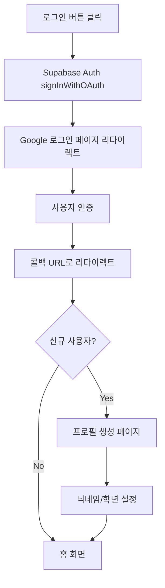
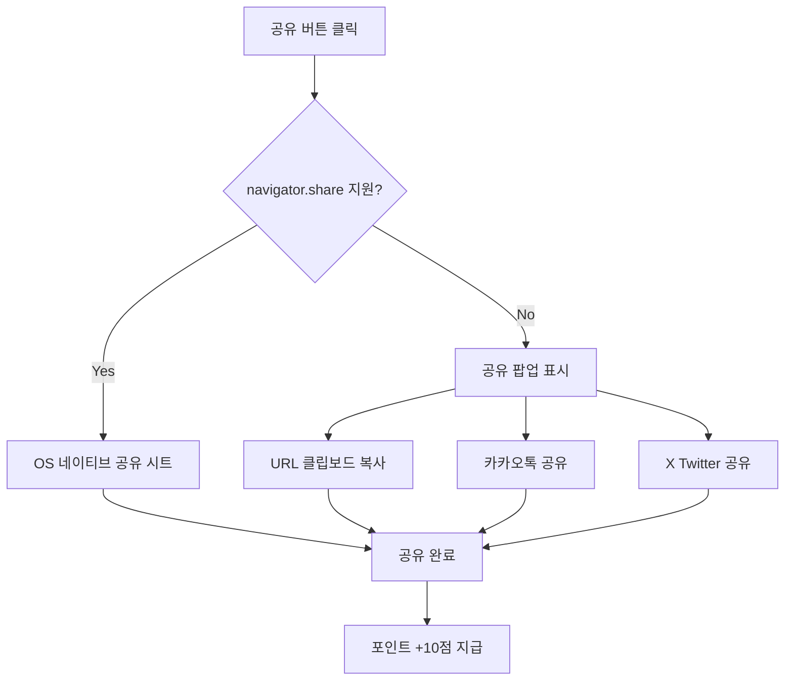
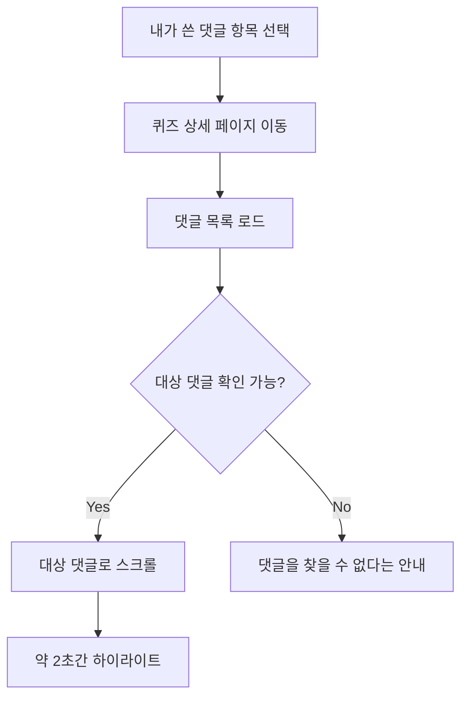
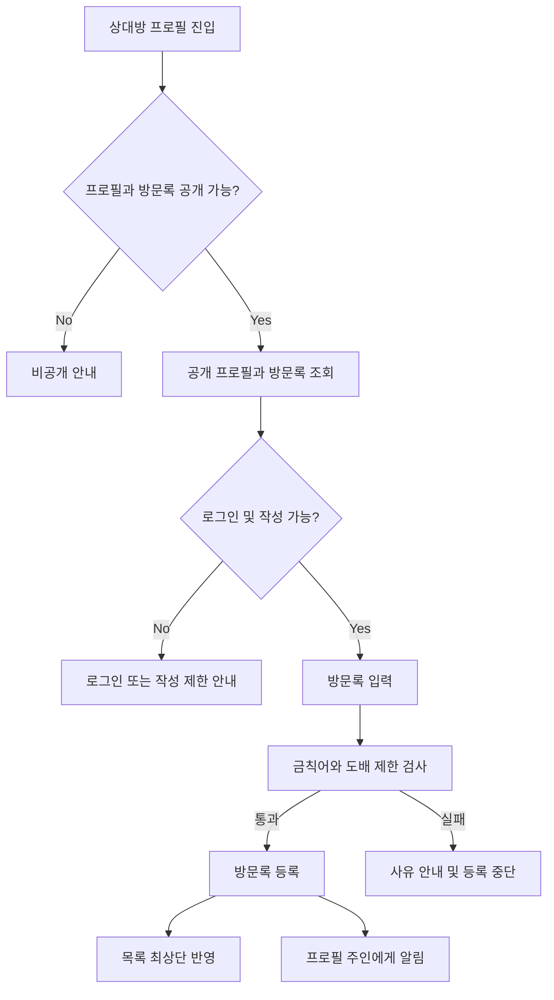
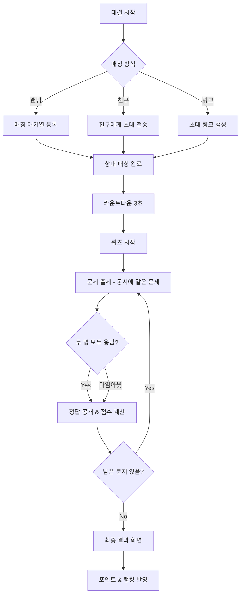

# 🎯 GoGoQuizKing 기획 문서

## 📋 프로젝트 개요

**GoGoQuizKing**은 초등학생(1~6학년)을 대상으로 한 재미있고 교육적인 퀴즈 커뮤니티 플랫폼입니다.

### 기술 스택

- **Frontend**: Nuxt.js 3, Quasar UI Framework
- **Backend**: Supabase (PostgreSQL, Auth, Realtime)
- **Language**: TypeScript
- **State Management**: Pinia

### 타겟 사용자

| 학년    | 연령    | 특징                             |
| ------- | ------- | -------------------------------- |
| 1~2학년 | 7~8세   | 시각적 요소 중심, 간단한 문제    |
| 3~4학년 | 9~10세  | 기본 읽기/쓰기 가능, 다양한 과목 |
| 5~6학년 | 11~12세 | 복잡한 문제 해결, 경쟁 요소 선호 |

---

## 🎨 디자인 가이드라인

### 컬러 팔레트

```scss
// 메인 컬러 - 밝고 활기찬 느낌
$primary: #ff6b6b; // 코랄 레드 (메인)
$secondary: #4ecdc4; // 민트 그린 (포인트)
$accent: #ffe66d; // 선샤인 옐로우 (강조)
$info: #45b7d1; // 스카이 블루 (정보)
$success: #95e77e; // 라임 그린 (정답)
$warning: #f7b32b; // 오렌지 (경고)
$negative: #ff6b6b; // 레드 (오답)

// 배경색
$bg-primary: #fff9f0; // 크림 화이트
$bg-secondary: #e8f4f8; // 연한 블루
```

### UI/UX 원칙

1. **큰 버튼과 터치 영역** - 최소 48px 이상
2. **명확한 아이콘 사용** - 텍스트보다 시각적 표현 우선
3. **긍정적 피드백** - 애니메이션, 사운드 효과, 칭찬 메시지
4. **게이미피케이션** - 포인트, 뱃지, 레벨 시스템
5. **접근성** - 큰 폰트 (최소 16px), 높은 대비

### 캐릭터 마스코트

- **퀴즈킹 왕관 캐릭터** - 친근하고 귀여운 마스코트
- 다양한 감정 표현 (정답/오답/응원/축하)

---

## 📱 핵심 기능

### 0. 인증 시스템 (Supabase Auth)

#### 0.1 소셜 로그인

Supabase Auth를 활용한 간편 로그인을 제공합니다.

##### 지원 로그인 방식

| 방식             | 설명                       | 우선순위 |
| ---------------- | -------------------------- | -------- |
| 🔵 Google 로그인 | OAuth 2.0 기반 소셜 로그인 | 🔴 높음  |
| 📧 이메일 로그인 | 이메일/비밀번호 기본 인증  | 🟡 중간  |
| 🍎 Apple 로그인  | iOS 사용자 대상            | 🟢 낮음  |
| 💬 카카오 로그인 | 한국 사용자 대상           | 🟢 낮음  |

##### Google 로그인 구현



##### Supabase 설정

```
[Google Cloud Console]
├── OAuth 2.0 클라이언트 ID 생성
├── 승인된 리다이렉트 URI 설정
│   └── https://[PROJECT_REF].supabase.co/auth/v1/callback
└── 클라이언트 ID/Secret 발급

[Supabase Dashboard]
├── Authentication > Providers > Google
├── Client ID 입력
├── Client Secret 입력
└── Enable 활성화
```

##### 코드 구현

```typescript
// 로그인 함수
async function signInWithGoogle() {
    const { data, error } = await supabase.auth.signInWithOAuth({
        provider: 'google',
        options: {
            redirectTo: `${window.location.origin}/confirm`,
            queryParams: {
                access_type: 'offline',
                prompt: 'consent',
            },
        },
    });
}

// 로그아웃 함수
async function signOut() {
    const { error } = await supabase.auth.signOut();
}

// 세션 확인
const {
    data: { session },
} = await supabase.auth.getSession();
```

##### 사용자 프로필 자동 생성

```sql
-- Supabase Database Trigger
CREATE OR REPLACE FUNCTION public.handle_new_user()
RETURNS TRIGGER AS $$
BEGIN
    INSERT INTO public.profiles (id, email, full_name, avatar_url)
    VALUES (
        NEW.id,
        NEW.email,
        NEW.raw_user_meta_data->>'full_name',
        NEW.raw_user_meta_data->>'avatar_url'
    );
    RETURN NEW;
END;
$$ LANGUAGE plpgsql SECURITY DEFINER;

CREATE TRIGGER on_auth_user_created
    AFTER INSERT ON auth.users
    FOR EACH ROW EXECUTE FUNCTION public.handle_new_user();
```

##### 로그인 화면 UI

```
┌─────────────────────────────────┐
│                                 │
│      🎯 GoGoQuizKing            │
│      퀴즈왕이 되어보세요!        │
│                                 │
├─────────────────────────────────┤
│                                 │
│  ┌─────────────────────────┐   │
│  │  🔵 Google로 시작하기    │   │
│  └─────────────────────────┘   │
│                                 │
│  ┌─────────────────────────┐   │
│  │  📧 이메일로 시작하기    │   │
│  └─────────────────────────┘   │
│                                 │
│  로그인하면 서비스 이용약관 및   │
│  개인정보 처리방침에 동의하게    │
│  됩니다.                        │
│                                 │
└─────────────────────────────────┘
```

##### 인증 체크리스트

- [ ] Google Cloud Console OAuth 설정
- [ ] Supabase Google Provider 활성화
- [ ] 로그인 페이지 UI 구현
- [ ] signInWithOAuth 연동
- [ ] 콜백 페이지 (/confirm) 구현
- [ ] 신규 사용자 프로필 생성 트리거
- [ ] 프로필 설정 페이지 (닉네임/학년)
- [ ] 로그아웃 기능
- [ ] 세션 유지/갱신
- [ ] 인증 미들웨어 (auth-guard)

### 1. 퀴즈 시스템

#### 1.1 퀴즈 생성

```
[신규 기능]
├── 문제 유형 선택
│   ├── 🔘 객관식 (4지선다)
│   ├── ⭕ OX 퀴즈
│   ├── ✏️ 단답형
│   └── 🖼️ 이미지 퀴즈
├── 학년별 난이도 설정
├── 과목/카테고리 선택
├── 힌트 추가 (선택)
└── 미리보기 & 저장
```

| 기능             | 설명                   | 우선순위 |
| ---------------- | ---------------------- | -------- |
| 객관식 퀴즈 생성 | 4개 보기 중 정답 선택  | 🔴 높음  |
| OX 퀴즈 생성     | 참/거짓 선택 문제      | 🔴 높음  |
| 단답형 퀴즈      | 텍스트 입력 정답       | 🟡 중간  |
| 이미지 퀴즈      | 이미지 기반 문제       | 🟡 중간  |
| 힌트 시스템      | 문제당 힌트 제공       | 🟢 낮음  |
| AI 문제 추천     | AI 기반 문제 자동 생성 | 🟢 낮음  |

#### 1.2 퀴즈 수정/관리

```
[퀴즈 관리]
├── 내가 만든 퀴즈 목록
├── 퀴즈 수정
├── 퀴즈 삭제
├── 공개/비공개 설정
└── 통계 확인 (풀이 수, 정답률)
```

#### 1.3 퀴즈 풀기

```
[퀴즈 플레이]
├── 카테고리별 퀴즈 탐색
├── 학년별 추천 퀴즈
├── 인기 퀴즈 랭킹
├── 친구가 만든 퀴즈
└── 오늘의 퀴즈 (데일리 미션)
```

### 2. 카테고리 시스템

#### 과목별 분류

| 카테고리 | 아이콘 | 설명                 |
| -------- | ------ | -------------------- |
| 국어     | 📚     | 맞춤법, 독해, 속담   |
| 수학     | 🔢     | 연산, 도형, 문제해결 |
| 사회     | 🌍     | 역사, 지리, 시사     |
| 과학     | 🔬     | 자연, 실험, 생물     |
| 영어     | 🔤     | 단어, 문법, 회화     |
| 상식     | 💡     | 일반 상식, 퀴즈      |
| 예체능   | 🎨     | 음악, 미술, 체육     |
| 재미     | 🎮     | 넌센스, 수수께끼     |

#### 학년별 난이도

```
🌱 새싹 (1~2학년) - 그림 중심, 간단한 문제
🌿 풀잎 (3~4학년) - 기본 학습 문제
🌳 나무 (5~6학년) - 심화 문제
👑 킹왕짱 (도전) - 최고 난이도
```

### 3. 게이미피케이션

#### 3.1 포인트 시스템

| 활동             | 포인트            |
| ---------------- | ----------------- |
| 퀴즈 정답        | +10점             |
| 연속 정답 보너스 | +5점 (3연속 이상) |
| 퀴즈 생성        | +20점             |
| 일일 출석        | +5점              |
| 퀴즈 공유        | +10점             |

#### 3.2 레벨 시스템

```
Lv.1  퀴즈 새싹     (0~100점)
Lv.2  퀴즈 풀잎     (101~300점)
Lv.3  퀴즈 나무     (301~600점)
Lv.4  퀴즈 숲       (601~1000점)
Lv.5  퀴즈 마스터   (1001~2000점)
Lv.6  퀴즈 챔피언   (2001~5000점)
Lv.7  퀴즈 킹       (5001점~)
```

#### 3.3 뱃지 시스템

| 뱃지        | 조건             | 아이콘 |
| ----------- | ---------------- | ------ |
| 첫 발걸음   | 첫 퀴즈 완료     | 👣     |
| 문제 제작자 | 첫 퀴즈 생성     | ✏️     |
| 연속 5일    | 5일 연속 접속    | 🔥     |
| 백점왕      | 퀴즈 전체 정답   | 💯     |
| 인기스타    | 퀴즈 100회 풀림  | ⭐     |
| 수학 천재   | 수학 50문제 정답 | 🧮     |

### 4. 커뮤니티 기능

#### 4.1 공지사항 (기존)

- 관리자 공지
- 이벤트 안내
- 업데이트 소식

#### 4.2 랭킹 시스템

```
[랭킹 종류]
├── 전체 랭킹 (포인트 기준)
├── 주간 랭킹
├── 학년별 랭킹
├── 과목별 랭킹
└── 친구 랭킹
```

#### 4.3 친구 시스템 (향후)

- 친구 추가/삭제
- 친구 퀴즈 도전
- 친구에게 퀴즈 추천

#### 4.4 퀴즈 공유 기능

퀴즈 상세 페이지 및 결과 화면에서 친구에게 퀴즈를 공유할 수 있습니다.

##### 공유 방식

| 환경                           | 방식                              | 설명                                                   |
| ------------------------------ | --------------------------------- | ------------------------------------------------------ |
| **모바일** (iOS/Android)       | Web Share API (`navigator.share`) | OS 네이티브 공유 시트 호출 (카카오톡, 메시지, 메일 등) |
| **데스크탑** (미지원 브라우저) | 클립보드 복사 + SNS 직접 링크     | URL 복사 버튼 + 카카오톡/X(Twitter) 공유 링크          |

##### 공유 데이터

```typescript
interface QuizShareData {
    title: string; // "[퀴즈 제목] - 고고퀴즈킹"
    text: string; // "이 퀴즈에 도전해보세요! 🎯"
    url: string; // "https://www.gogoquizking.net/quiz/{id}"
}
```

##### 공유 위치

```
[공유 버튼 노출 위치]
├── 퀴즈 상세 페이지 - 상단 액션 버튼
├── 퀴즈 결과 화면 - 결과 공유 ("나는 10문제 중 8문제 맞췄어!")
├── 퀴즈 목록 - 카드 더보기 메뉴
└── 대결 결과 화면 - 대결 결과 공유
```

##### 구현 흐름



##### 공유 보상

| 활동             | 포인트 | 조건                 |
| ---------------- | ------ | -------------------- |
| 퀴즈 공유        | +10점  | 1일 최대 3회         |
| 공유 링크로 유입 | +5점   | 공유자에게 추가 보상 |

##### Composable 설계

```typescript
// composables/use-quiz-share.ts
interface UseQuizShareReturn {
    shareQuiz: (quiz: QuizShareData) => Promise<boolean>;
    shareResult: (result: QuizResultShareData) => Promise<boolean>;
    isNativeShareSupported: ComputedRef<boolean>;
}
```

#### 4.5 마이페이지 - 내가 쓴 댓글

마이페이지에서 사용자가 작성한 댓글과 답글을 모아 보고, 해당 댓글이 있는 퀴즈 상세 위치로 바로 이동할 수 있습니다.

##### 진입 경로

```
[마이페이지]
└── 💬 내가 쓴 댓글
    └── /profile/comments
```

##### 목록 구성

| 항목      | 표시 내용                                         |
| --------- | ------------------------------------------------- |
| 댓글 유형 | `댓글` / `답글` 배지                              |
| 댓글 내용 | 최대 2줄 미리보기 (초과 시 말줄임)                |
| 퀴즈 정보 | 퀴즈 제목 및 카테고리                             |
| 작성 정보 | 작성일, 수정된 경우 `수정됨` 표시                 |
| 이동      | 항목 전체를 터치하면 해당 퀴즈의 댓글 위치로 이동 |

- 최신 작성순으로 노출하고, 최초 20개 이후에는 `더 보기` 방식으로 페이지네이션합니다.
- 본인이 삭제한 댓글은 목록에서 즉시 제거합니다.
- 삭제된 퀴즈 또는 현재 열람 권한이 없는 비공개 퀴즈의 댓글은 노출하지 않습니다.
- 목록이 비어 있으면 `아직 작성한 댓글이 없어요. 퀴즈에 첫 댓글을 남겨보세요!` 안내와 `퀴즈 둘러보기` 버튼을 제공합니다.

##### 댓글 위치 이동 규칙



- 이동 URL은 `/quiz/{quiz_id}?comment={comment_id}#comment-{comment_id}` 형식을 사용합니다.
- 대상이 답글이면 부모 댓글 영역을 함께 펼친 뒤 답글로 이동합니다.
- 댓글 목록 로딩이 끝난 후 스크롤하며, 고정 헤더에 가리지 않도록 상단 여백을 적용합니다.
- 다른 탭에서 댓글이 삭제된 경우 토스트로 안내하고 댓글 영역 상단으로 이동합니다.

##### 조회 데이터

```typescript
interface MyCommentListItem {
    id: string;
    quiz_id: string;
    parent_id: string | null;
    content: string;
    created_at: string;
    updated_at: string;
    quiz: {
        title: string;
        category: string;
    };
}
```

##### 수용 기준

- [ ] 로그인 사용자는 마이페이지에서 `내가 쓴 댓글` 메뉴를 확인할 수 있다.
- [ ] 자신이 작성한 일반 댓글과 답글이 최신순으로 표시된다.
- [ ] 목록 항목을 선택하면 퀴즈 상세의 정확한 댓글로 이동하고 하이라이트된다.
- [ ] 삭제되었거나 열람 권한이 없는 퀴즈의 댓글은 목록에 노출되지 않는다.
- [ ] 로딩, 빈 목록, 추가 로딩, 이동 대상 없음 상태가 각각 안내된다.

#### 4.6 댓글 프로필 네임 멘션

댓글과 답글에서 `@프로필명`으로 같은 퀴즈 대화에 참여한 사용자를 부를 수 있습니다. 화면에는 프로필 네임을 표시하되, 동명이인과 프로필명 변경에 안전하도록 내부 데이터는 사용자 ID와 연결합니다.

##### 작성 경험

| 동작                | 결과                                                     |
| ------------------- | -------------------------------------------------------- |
| 입력창에서 `@` 입력 | 멘션 가능한 사용자 추천 목록 표시                        |
| 추천 사용자 선택    | 커서 위치에 `@프로필명` 삽입                             |
| 댓글의 `답글` 선택  | 답글 입력창을 열고 원댓글 작성자의 `@프로필명` 자동 입력 |
| 멘션 삭제           | 본문에서 멘션 텍스트 전체를 지우면 연결 정보도 제거      |
| 댓글 등록           | 멘션된 사용자에게 알림 이벤트 생성 (본인 멘션 제외)      |

##### 추천 대상과 표시 규칙

- 추천 대상은 해당 퀴즈 작성자와 현재 댓글 대화 참여자로 제한합니다.
- 답글 작성 시 답글 대상자를 추천 목록 최상단에 표시합니다.
- 추천 항목에는 아바타와 프로필 네임을 함께 표시합니다.
- 동명이인이 있어도 선택한 사용자의 ID로 구분하며, 필요하면 레벨 등 최소한의 보조 정보만 함께 표시합니다.
- 본인도 멘션 텍스트로 선택할 수 있지만 본인에게 알림은 발송하지 않습니다.
- 등록된 멘션은 본문에서 기본 텍스트와 구분되는 색상과 굵기로 표시합니다.
- 모바일에서 추천 목록이 키보드에 가리지 않도록 입력창 위쪽 노출을 우선합니다.

##### 멘션 처리 원칙

```mermaid
flowchart TD
    A[@ 입력 또는 답글 선택] --> B[추천 사용자 조회]
    B --> C[사용자 선택]
    C --> D[본문에 프로필 네임 표시]
    D --> E[댓글 등록]
    E --> F[댓글 본문 저장]
    E --> G[사용자 ID 기반 멘션 관계 저장]
    G --> H{본인 멘션인가?}
    H -->|No| I[멘션 알림 생성]
    H -->|Yes| J[알림 생략]
```

- 멘션은 `@이름` 문자열만 파싱해 확정하지 않고, 추천 목록에서 선택된 사용자 ID를 함께 저장합니다.
- 댓글 수정 시 추가·삭제된 멘션 관계를 본문과 동기화합니다.
- 동일 댓글에서 같은 사용자를 여러 번 멘션해도 알림은 한 번만 생성합니다.
- 멘션 알림을 선택하면 4.5와 동일한 댓글 위치 이동 규칙을 사용합니다.
- 차단 사용자, 탈퇴 사용자 또는 열람 권한이 없는 사용자는 추천 및 알림 대상에서 제외합니다.

##### 알림 문구

```
{작성자 프로필명}님이 댓글에서 회원님을 언급했어요.
"{댓글 내용 최대 40자}"
```

##### 수용 기준

- [ ] 댓글 및 답글 입력창에서 `@`를 입력하면 멘션 추천 목록이 표시된다.
- [ ] 답글 버튼을 누르면 대상 작성자의 프로필 네임이 자동으로 입력된다.
- [ ] 선택한 멘션은 사용자 ID와 연결되어 동명이인을 구분할 수 있다.
- [ ] 등록된 `@프로필명`은 댓글 본문에서 시각적으로 구분된다.
- [ ] 멘션된 사용자는 중복 없이 알림을 받고 해당 댓글로 이동할 수 있다.
- [ ] 댓글 수정·삭제 시 멘션 관계와 알림 상태가 일관되게 처리된다.

#### 4.7 공개 프로필 방문록

댓글 작성자, 랭킹 사용자, 퀴즈 제작자의 프로필 네임 또는 아바타를 선택하면 상대방의 공개 프로필로 이동할 수 있습니다. 로그인 사용자는 상대방이 방문록을 허용한 경우 짧은 인사와 응원 메시지를 남길 수 있습니다.

##### 진입 경로

```
[상대방 프로필 진입]
├── 퀴즈 댓글 작성자 프로필 네임/아바타
├── 랭킹 사용자 카드
├── 퀴즈 상세의 제작자 정보
├── 멘션된 프로필 네임
└── 방문록 작성자 프로필 네임/아바타
    └── /profile/{user_id}
```

##### 공개 프로필 표시 정보

| 항목 | 표시 내용 |
| --- | --- |
| 기본 정보 | 아바타, 프로필 네임, 레벨 |
| 활동 정보 | 획득 뱃지, 만든 공개 퀴즈 수, 활동 통계 요약 |
| 커뮤니티 | 방문록 목록과 작성 입력창 |
| 비공개 정보 | 이메일, 로그인 제공자, 학년 등 개인 식별 가능 정보는 미노출 |

- 본인의 프로필 URL로 접근하면 기존 마이페이지로 이동하거나 `내 프로필 관리` 버튼을 표시합니다.
- 탈퇴, 정지 또는 비공개 처리된 프로필은 최소 정보만 표시하고 방문록 작성을 허용하지 않습니다.
- 검색엔진에는 공개 프로필과 방문록 본문을 색인하지 않도록 `noindex`를 적용합니다.

##### 방문록 작성 규칙

| 항목 | 정책 |
| --- | --- |
| 작성 권한 | 로그인 사용자만 가능 |
| 글자 수 | 공백 제외 1자 이상, 최대 300자 |
| 작성 제한 | 같은 프로필에 1일 최대 3개, 연속 작성 60초 제한 |
| 목록 정렬 | 최신 작성순, 최초 20개 이후 `더 보기` |
| MVP 범위 | 방문록 답글과 이미지 첨부는 제외 |
| 본인 방문록 | 본인 프로필에는 작성 불가 |

- 방문록 등록 전 금칙어 및 반복 문자 검사를 수행합니다.
- 등록 성공 시 목록 최상단에 즉시 반영하고 프로필 주인에게 알림을 생성합니다.
- 동일 사용자가 짧은 시간에 여러 프로필에 반복 메시지를 남기는 경우 추가 도배 제한을 적용합니다.

##### 방문록 관리 권한

| 사용자 | 가능한 동작 |
| --- | --- |
| 작성자 | 본인이 작성한 방문록 수정·삭제 |
| 프로필 주인 | 자신의 프로필에 작성된 방문록 숨김·삭제·신고·작성자 차단 |
| 일반 방문자 | 방문록 조회 및 신고 |
| 관리자/운영자 | 신고된 방문록 조회, 숨김·삭제, 사용자 제재 |

- 작성자가 수정하면 `수정됨`을 표시합니다.
- 프로필 주인이 숨긴 방문록은 작성자 본인에게만 `프로필 주인이 숨긴 글입니다` 상태로 표시합니다.
- 삭제는 운영 검토와 신고 이력을 위해 소프트 삭제를 기본으로 하며 일반 사용자 화면에는 본문을 노출하지 않습니다.
- 차단 관계에서는 상대방 프로필의 방문록 조회·작성과 알림을 모두 제한합니다.

##### 프로필 주인 설정

```
[프로필 설정 > 방문록]
├── 방문록 사용
│   ├── 켜기 (기본값)
│   └── 끄기
└── 공개 범위
    ├── 모든 로그인 사용자 (기본값)
    ├── 친구만 (친구 기능 도입 후)
    └── 나만 보기
```

- 방문록을 끄면 기존 글은 삭제하지 않고 프로필 주인에게만 보관 목록으로 제공합니다.
- 다시 켜면 숨김·삭제되지 않은 기존 방문록을 재노출합니다.
- 친구 시스템 도입 전 `친구만` 옵션은 비활성 상태와 준비 중 안내를 표시합니다.

##### 방문록 작성 흐름



##### 화면 구성

```
┌─────────────────────────────────┐
│ ← 뒤로       친구의 프로필       │
├─────────────────────────────────┤
│       [아바타]  퀴즈친구          │
│       Lv.5 퀴즈 마스터           │
│  🏅 뱃지 12개  📝 공개 퀴즈 8개  │
├─────────────────────────────────┤
│ 💌 방문록                        │
│ ┌─────────────────────────────┐ │
│ │ 응원 메시지를 남겨보세요!    │ │
│ └─────────────────────────────┘ │
│                    0/300 [남기기]│
├─────────────────────────────────┤
│ [아바타] 수학왕                  │
│ 퀴즈가 정말 재미있었어요!        │
│ 3분 전                    [⋮]    │
└─────────────────────────────────┘
```

##### 알림 문구

```
{작성자 프로필명}님이 회원님의 방문록에 글을 남겼어요.
"{방문록 내용 최대 40자}"
```

- 알림을 선택하면 `/profile/{profile_owner_id}?guestbook={entry_id}#guestbook-{entry_id}`로 이동하고 대상 방문록을 하이라이트합니다.
- 본인이 쓴 방문록 수정·삭제와 운영자 숨김에는 새 알림을 생성하지 않습니다.

##### 수용 기준

- [x] 댓글, 랭킹, 퀴즈 상세에서 상대방 공개 프로필로 이동할 수 있다.
- [x] 공개 프로필에는 허용된 정보만 표시되고 이메일 등 개인정보는 노출되지 않는다.
- [x] 로그인 사용자는 방문록이 활성화된 상대방 프로필에 300자 이하의 글을 남길 수 있다.
- [x] 작성 제한, 금칙어, 차단 관계에 따라 등록이 안전하게 제한된다.
- [x] 작성자는 본인의 글을 수정·삭제할 수 있고 프로필 주인은 방문록을 숨김·삭제할 수 있다.
- [x] 프로필 주인은 방문록 사용 여부와 공개 범위를 변경할 수 있다.
- [x] 새 방문록 알림을 선택하면 해당 프로필의 정확한 방문록으로 이동한다.
- [x] 로딩, 빈 목록, 비공개, 사용 중지, 추가 로딩 상태가 각각 안내된다.

### 5. ⚔️ 실시간 1:1 퀴즈 대결

#### 5.1 개요

실시간으로 다른 사용자와 1:1 퀴즈 대결을 할 수 있는 기능입니다.
Supabase Realtime을 활용하여 실시간 동기화를 구현합니다.

```
[대결 모드]
├── 🎲 랜덤 매칭 - 비슷한 레벨의 상대와 자동 매칭
├── 👥 친구 대결 - 친구에게 대결 신청
├── 🔗 초대 링크 - 링크로 대결 초대
└── 🏆 랭킹전 - 시즌 랭킹 포인트 획득
```

#### 5.2 대결 흐름



#### 5.3 대결 규칙

| 항목             | 내용                                     |
| ---------------- | ---------------------------------------- |
| 문제 수          | 5문제 (빠른 대결) / 10문제 (일반 대결)   |
| 문제당 제한 시간 | 15초                                     |
| 점수 계산        | 정답 +100점, 빠른 응답 보너스 최대 +50점 |
| 연속 정답 보너스 | 3연속 +30점, 5연속 +50점                 |
| 매칭 제한 시간   | 30초 (초과 시 봇 매칭 또는 취소)         |

#### 5.4 점수 계산 공식

```typescript
// 기본 점수
const BASE_SCORE = 100;

// 시간 보너스 (15초 기준, 빨리 맞출수록 높음)
const timeBonus = Math.floor((15 - responseTime) * 3.33); // 최대 50점

// 연속 정답 보너스
const streakBonus = streak >= 5 ? 50 : streak >= 3 ? 30 : 0;

// 최종 점수
const finalScore = isCorrect ? BASE_SCORE + timeBonus + streakBonus : 0;
```

#### 5.5 매칭 시스템

```
[매칭 알고리즘]
├── 레벨 기반 매칭
│   ├── 동일 레벨 우선
│   ├── ±1 레벨 범위 확장 (10초 후)
│   └── ±2 레벨 범위 확장 (20초 후)
├── 학년 기반 필터 (선택)
│   └── 같은 학년끼리 대결 옵션
└── 봇 매칭 (30초 초과)
    └── AI 봇과 대결 (레벨별 난이도 조절)
```

#### 5.6 대결 보상

| 결과                  | 포인트 | 랭킹 포인트 (랭킹전) |
| --------------------- | ------ | -------------------- |
| 🏆 승리               | +50점  | +25 RP               |
| 🤝 무승부             | +20점  | +5 RP                |
| 😢 패배               | +10점  | -10 RP               |
| 🔥 완승 (전문제 정답) | +100점 | +50 RP               |

#### 5.7 대결 뱃지

| 뱃지        | 조건                    | 아이콘 |
| ----------- | ----------------------- | ------ |
| 첫 승리     | 첫 대결 승리            | ⚔️     |
| 연승왕      | 5연승 달성              | 🔥     |
| 스피드스터  | 평균 응답 3초 이내 승리 | ⚡     |
| 대결왕      | 100승 달성              | 👑     |
| 완벽한 승리 | 전문제 정답 승리 10회   | 💎     |
| 라이벌      | 같은 상대와 10회 대결   | 🤝     |

#### 5.8 실시간 대결 화면

```
┌─────────────────────────────────┐
│  ⚔️ 퀴즈 대결                    │
├─────────────────────────────────┤
│  ┌───────────┐  ┌───────────┐  │
│  │ 🧒 나      │  │ 👧 상대    │  │
│  │ Lv.5      │  │ Lv.6      │  │
│  │ 350점     │  │ 420점     │  │
│  │ ⭕⭕❌     │  │ ⭕⭕⭕     │  │
│  └───────────┘  └───────────┘  │
├─────────────────────────────────┤
│           Q.4 / 5               │
│          ⏱️ 12초               │
├─────────────────────────────────┤
│                                 │
│   "대한민국의 수도는?"           │
│                                 │
│  ┌────────────────────────┐    │
│  │  ① 서울               │    │
│  └────────────────────────┘    │
│  ┌────────────────────────┐    │
│  │  ② 부산               │    │
│  └────────────────────────┘    │
│  ┌────────────────────────┐    │
│  │  ③ 대전               │    │
│  └────────────────────────┘    │
│  ┌────────────────────────┐    │
│  │  ④ 인천               │    │
│  └────────────────────────┘    │
│                                 │
│  ████████████░░░  80%          │
└─────────────────────────────────┘
```

#### 5.9 대결 결과 화면

```
┌─────────────────────────────────┐
│        🎉 대결 종료! 🎉          │
├─────────────────────────────────┤
│                                 │
│         🏆 승리! 🏆              │
│                                 │
│  ┌───────────────────────────┐ │
│  │  나 (520점)  VS  상대 (380점) │ │
│  │  ⭕⭕⭕⭕⭕      ⭕⭕⭕❌❌    │ │
│  └───────────────────────────┘ │
│                                 │
│  📊 상세 결과                    │
│  ├── 정답 수: 5/5 🎯            │
│  ├── 평균 응답: 4.2초 ⚡        │
│  ├── 획득 점수: +520점          │
│  └── 보너스: +50점 (승리)       │
│                                 │
│  🎁 획득 보상                    │
│  ├── 포인트: +100점 💰          │
│  └── 랭킹 포인트: +25 RP 📈     │
│                                 │
│  ┌────────┐  ┌────────┐        │
│  │ 재대결  │  │  홈으로 │        │
│  └────────┘  └────────┘        │
│                                 │
└─────────────────────────────────┘
```

---

## 🗂️ 데이터베이스 설계

### 주요 테이블

#### quizzes (퀴즈)

```sql
CREATE TABLE quizzes (
  id UUID PRIMARY KEY DEFAULT gen_random_uuid(),
  created_by UUID REFERENCES auth.users(id),
  title VARCHAR(100) NOT NULL,
  description TEXT,
  category VARCHAR(50) NOT NULL,
  grade_level INT CHECK (grade_level BETWEEN 1 AND 6),
  difficulty VARCHAR(20) DEFAULT 'normal',
  is_public BOOLEAN DEFAULT true,
  play_count INT DEFAULT 0,
  created_at TIMESTAMP DEFAULT NOW(),
  updated_at TIMESTAMP DEFAULT NOW()
);
```

#### questions (문제)

```sql
CREATE TABLE questions (
  id UUID PRIMARY KEY DEFAULT gen_random_uuid(),
  quiz_id UUID REFERENCES quizzes(id) ON DELETE CASCADE,
  question_type VARCHAR(20) NOT NULL, -- 'multiple', 'ox', 'short', 'image'
  question_text TEXT NOT NULL,
  question_image_url TEXT,
  correct_answer TEXT NOT NULL,
  options JSONB, -- 객관식 보기
  hint TEXT,
  order_index INT,
  created_at TIMESTAMP DEFAULT NOW()
);
```

#### quiz_attempts (퀴즈 시도)

```sql
CREATE TABLE quiz_attempts (
  id UUID PRIMARY KEY DEFAULT gen_random_uuid(),
  user_id UUID REFERENCES auth.users(id),
  quiz_id UUID REFERENCES quizzes(id),
  score INT NOT NULL,
  total_questions INT NOT NULL,
  time_spent INT, -- 초 단위
  completed_at TIMESTAMP DEFAULT NOW()
);
```

#### user_profiles (사용자 프로필)

```sql
CREATE TABLE user_profiles (
  id UUID PRIMARY KEY REFERENCES auth.users(id),
  nickname VARCHAR(50) NOT NULL,
  grade_level INT CHECK (grade_level BETWEEN 1 AND 6),
  avatar_url TEXT,
  points INT DEFAULT 0,
  level INT DEFAULT 1,
  badges JSONB DEFAULT '[]',
  streak_days INT DEFAULT 0,
  last_active_at TIMESTAMP,
  created_at TIMESTAMP DEFAULT NOW()
);
```

#### quiz_comments (퀴즈 댓글)

```sql
CREATE TABLE quiz_comments (
  id UUID PRIMARY KEY DEFAULT gen_random_uuid(),
  quiz_id UUID NOT NULL REFERENCES quizzes(id) ON DELETE CASCADE,
  user_id UUID NOT NULL REFERENCES user_profiles(id) ON DELETE CASCADE,
  parent_id UUID REFERENCES quiz_comments(id) ON DELETE CASCADE,
  content TEXT NOT NULL,
  created_at TIMESTAMP WITH TIME ZONE DEFAULT NOW(),
  updated_at TIMESTAMP WITH TIME ZONE DEFAULT NOW()
);

-- 마이페이지 내 댓글 조회 최적화
CREATE INDEX idx_quiz_comments_user_created_at
  ON quiz_comments(user_id, created_at DESC);
```

#### quiz_comment_mentions (댓글 멘션)

```sql
CREATE TABLE quiz_comment_mentions (
  id UUID PRIMARY KEY DEFAULT gen_random_uuid(),
  comment_id UUID NOT NULL REFERENCES quiz_comments(id) ON DELETE CASCADE,
  mentioned_user_id UUID NOT NULL REFERENCES user_profiles(id) ON DELETE CASCADE,
  mention_text VARCHAR(50) NOT NULL,
  start_offset INT NOT NULL,
  length INT NOT NULL,
  created_at TIMESTAMP WITH TIME ZONE DEFAULT NOW(),
  UNIQUE(comment_id, mentioned_user_id, start_offset)
);

CREATE INDEX idx_quiz_comment_mentions_user_created_at
  ON quiz_comment_mentions(mentioned_user_id, created_at DESC);
```

- `mention_text`와 위치 정보는 작성 당시 본문 렌더링에 사용하고, 실제 사용자 식별과 알림 대상 결정에는 `mentioned_user_id`를 사용합니다.
- 같은 사용자를 한 댓글에서 여러 번 표시할 수 있지만 알림 생성 시에는 `comment_id + mentioned_user_id` 기준으로 중복을 제거합니다.
- 멘션 관계 생성·수정은 댓글 작성자 본인만 가능하고, 조회 권한은 원본 댓글을 볼 수 있는 사용자와 멘션 당사자에게만 부여합니다.
- 알림 시스템 구현 시 `quiz_comment_mentions` 생성 이벤트를 알림 레코드와 연결합니다.

#### profile_guestbook_entries (프로필 방문록)

```sql
CREATE TABLE profile_guestbook_entries (
  id UUID PRIMARY KEY DEFAULT gen_random_uuid(),
  profile_owner_id UUID NOT NULL REFERENCES user_profiles(id) ON DELETE CASCADE,
  author_id UUID NOT NULL REFERENCES user_profiles(id) ON DELETE CASCADE,
  content VARCHAR(300) NOT NULL,
  status VARCHAR(20) NOT NULL DEFAULT 'visible',
  hidden_by UUID REFERENCES user_profiles(id),
  hidden_at TIMESTAMP WITH TIME ZONE,
  created_at TIMESTAMP WITH TIME ZONE DEFAULT NOW(),
  updated_at TIMESTAMP WITH TIME ZONE DEFAULT NOW(),
  CHECK (profile_owner_id <> author_id),
  CHECK (status IN ('visible', 'hidden', 'deleted'))
);

CREATE INDEX idx_profile_guestbook_owner_created_at
  ON profile_guestbook_entries(profile_owner_id, created_at DESC);

CREATE INDEX idx_profile_guestbook_author_created_at
  ON profile_guestbook_entries(author_id, created_at DESC);
```

#### profile_guestbook_settings (방문록 설정)

```sql
CREATE TABLE profile_guestbook_settings (
  profile_id UUID PRIMARY KEY REFERENCES user_profiles(id) ON DELETE CASCADE,
  is_enabled BOOLEAN NOT NULL DEFAULT true,
  visibility VARCHAR(20) NOT NULL DEFAULT 'members',
  updated_at TIMESTAMP WITH TIME ZONE DEFAULT NOW(),
  CHECK (visibility IN ('members', 'friends', 'private'))
);
```

- 방문록 조회는 프로필 주인의 설정, 차단 관계, 글 상태를 모두 만족한 경우에만 허용합니다.
- 작성자는 자신의 방문록만 수정·삭제할 수 있고, 프로필 주인은 자신의 프로필에 작성된 글을 숨김·삭제할 수 있습니다.
- 작성 API 또는 RPC에서 글자 수, 60초 간격, 대상별 일일 3개 제한을 검증합니다.
- `status`와 숨김 정보를 유지해 신고 및 운영 검토 이력을 보존합니다.
- 새 방문록 생성 시 프로필 주인에게 알림 이벤트를 생성하되 작성자 본인과 차단 관계에는 발송하지 않습니다.

#### battle_rooms (대결 방)

```sql
CREATE TABLE battle_rooms (
  id UUID PRIMARY KEY DEFAULT gen_random_uuid(),
  room_code VARCHAR(10) UNIQUE, -- 초대 링크용 코드
  host_id UUID REFERENCES auth.users(id),
  guest_id UUID REFERENCES auth.users(id),
  quiz_id UUID REFERENCES quizzes(id),
  status VARCHAR(20) DEFAULT 'waiting', -- 'waiting', 'ready', 'playing', 'finished', 'cancelled'
  battle_type VARCHAR(20) DEFAULT 'quick', -- 'quick'(5문제), 'normal'(10문제), 'ranked'
  current_question_index INT DEFAULT 0,
  host_score INT DEFAULT 0,
  guest_score INT DEFAULT 0,
  host_answers JSONB DEFAULT '[]',
  guest_answers JSONB DEFAULT '[]',
  winner_id UUID REFERENCES auth.users(id),
  started_at TIMESTAMP,
  finished_at TIMESTAMP,
  created_at TIMESTAMP DEFAULT NOW()
);
```

#### battle_matchmaking (매칭 대기열)

```sql
CREATE TABLE battle_matchmaking (
  id UUID PRIMARY KEY DEFAULT gen_random_uuid(),
  user_id UUID REFERENCES auth.users(id) UNIQUE,
  user_level INT NOT NULL,
  grade_level INT,
  battle_type VARCHAR(20) DEFAULT 'quick',
  same_grade_only BOOLEAN DEFAULT false,
  created_at TIMESTAMP DEFAULT NOW()
);

-- 자동 만료 (30초 후)
CREATE INDEX idx_matchmaking_created ON battle_matchmaking(created_at);
```

#### battle_history (대결 기록)

```sql
CREATE TABLE battle_history (
  id UUID PRIMARY KEY DEFAULT gen_random_uuid(),
  room_id UUID REFERENCES battle_rooms(id),
  user_id UUID REFERENCES auth.users(id),
  opponent_id UUID REFERENCES auth.users(id),
  result VARCHAR(10) NOT NULL, -- 'win', 'lose', 'draw'
  my_score INT NOT NULL,
  opponent_score INT NOT NULL,
  points_earned INT DEFAULT 0,
  ranking_points_earned INT DEFAULT 0,
  created_at TIMESTAMP DEFAULT NOW()
);
```

#### user_ranking_stats (랭킹전 통계)

```sql
CREATE TABLE user_ranking_stats (
  id UUID PRIMARY KEY REFERENCES auth.users(id),
  ranking_points INT DEFAULT 1000, -- 기본 1000 RP (ELO 방식)
  season_wins INT DEFAULT 0,
  season_losses INT DEFAULT 0,
  season_draws INT DEFAULT 0,
  win_streak INT DEFAULT 0,
  best_win_streak INT DEFAULT 0,
  season_id INT DEFAULT 1,
  updated_at TIMESTAMP DEFAULT NOW()
);
```

---

## 📅 개발 로드맵

### Phase 1: 기초 기능 (MVP) - 4주

| 주차  | 작업 항목                                         |
| ----- | ------------------------------------------------- |
| 0주차 | **✅ 인증 시스템 (Supabase Auth + Google OAuth)** |
| 1주차 | 디자인 시스템 구축, UI 컴포넌트 제작              |
| 2주차 | 퀴즈 생성 기능 (객관식, OX)                       |
| 3주차 | 퀴즈 풀기 기능, 결과 화면                         |
| 4주차 | 퀴즈 목록, 검색, 필터링                           |

### Phase 2: 핵심 확장 - 4주

| 주차  | 작업 항목                  |
| ----- | -------------------------- |
| 5주차 | 포인트 시스템, 레벨 시스템 |
| 6주차 | 랭킹 시스템, 리더보드      |
| 7주차 | 뱃지 시스템, 업적          |
| 8주차 | 마이페이지, 통계 대시보드  |

### Phase 3: 커뮤니티 - 3주

| 주차   | 작업 항목                                                   |
| ------ | ----------------------------------------------------------- |
| 9주차  | 퀴즈 댓글/좋아요, 마이페이지 내가 쓴 댓글, 프로필 네임 멘션 |
| 10주차 | 공개 프로필, 프로필 방문록, 오늘의 퀴즈, 데일리 미션       |
| 11주차 | 알림 시스템, 멘션·방문록 알림 및 대상 위치 이동 연동       |

### Phase 4: 고도화 - 3주

| 주차   | 작업 항목              |
| ------ | ---------------------- |
| 12주차 | 성능 최적화, 테스트    |
| 13주차 | 모바일 반응형 완성     |
| 14주차 | 베타 테스트, 버그 수정 |

### Phase 5: 실시간 대결 - 4주

| 주차   | 작업 항목                                        |
| ------ | ------------------------------------------------ |
| 15주차 | 대결 방 생성/참가 시스템, Supabase Realtime 연동 |
| 16주차 | 매칭 시스템 (랜덤/친구/초대링크)                 |
| 17주차 | 실시간 대결 게임 로직, 점수 계산                 |
| 18주차 | 대결 결과/보상/랭킹전 시스템                     |

---

## 📐 화면 구성

### 주요 페이지

```
/                    # 홈 (대시보드)
/login               # 로그인
/register            # 회원가입
/quiz
  /quiz-list         # 퀴즈 목록
  /quiz-create       # 퀴즈 생성
  /quiz-edit/:id     # 퀴즈 수정
  /quiz-play/:id     # 퀴즈 풀기
  /quiz-result/:id   # 결과 화면
/battle
  /lobby             # 대결 로비 (매칭 선택)
  /matchmaking       # 매칭 대기 화면
  /room/:id          # 대결 방 (실시간 대결)
  /result/:id        # 대결 결과
  /history           # 대결 기록
/profile
  /:user_id          # 상대방 공개 프로필 및 방문록
  /my-quizzes        # 내 퀴즈 관리
  /comments          # 내가 쓴 댓글
  /my-stats          # 내 통계
  /settings          # 설정
/ranking             # 랭킹
/notice              # 공지사항
```

### 화면 와이어프레임

#### 홈 화면

```
┌─────────────────────────────────┐
│  🎯 GoGoQuizKing    [👤 프로필] │
├─────────────────────────────────┤
│  ┌─────────┐  ┌─────────┐      │
│  │ 📊 내 점수│  │ 🔥 연속  │      │
│  │  1,250   │  │  5일    │      │
│  └─────────┘  └─────────┘      │
├─────────────────────────────────┤
│  🎯 오늘의 퀴즈                  │
│  ┌─────────────────────────┐   │
│  │ "한글 맞춤법 퀴즈"        │   │
│  │ ⭐⭐⭐ 3학년 추천           │   │
│  │        [도전하기!]        │   │
│  └─────────────────────────┘   │
├─────────────────────────────────┤
│  🏆 인기 퀴즈 TOP 5             │
│  1. 곱셈 마스터          ▶     │
│  2. 과학 상식            ▶     │
│  3. 영어 단어            ▶     │
├─────────────────────────────────┤
│ [🏠홈][📝만들기][🎮퀴즈][👑랭킹]│
└─────────────────────────────────┘
```

#### 퀴즈 풀기 화면

```
┌─────────────────────────────────┐
│  ← 뒤로    Q.3/10    ⏱️ 0:45   │
├─────────────────────────────────┤
│                                 │
│   "사과의 영어 단어는?"          │
│                                 │
│  ┌─────────────────────────┐   │
│  │      🍎 (이미지)         │   │
│  └─────────────────────────┘   │
│                                 │
│  ┌────────────────────────┐    │
│  │  ① Apple               │    │
│  └────────────────────────┘    │
│  ┌────────────────────────┐    │
│  │  ② Banana              │    │
│  └────────────────────────┘    │
│  ┌────────────────────────┐    │
│  │  ③ Orange              │    │
│  └────────────────────────┘    │
│  ┌────────────────────────┐    │
│  │  ④ Grape               │    │
│  └────────────────────────┘    │
│                                 │
│  [💡 힌트 보기]                 │
│                                 │
│  ████████░░░░░░░░  30%         │
└─────────────────────────────────┘
```

---

## ✅ 체크리스트

### 디자인

- [ ] 컬러 팔레트 적용
- [ ] 마스코트 캐릭터 디자인
- [ ] UI 컴포넌트 라이브러리
- [ ] 반응형 레이아웃
- [ ] 애니메이션 효과

### 퀴즈 기능

- [ ] 객관식 퀴즈 CRUD
- [ ] OX 퀴즈 CRUD
- [ ] 단답형 퀴즈 CRUD
- [ ] 이미지 퀴즈 CRUD
- [ ] 퀴즈 플레이 엔진
- [ ] 결과 계산 및 저장
- [ ] 힌트 시스템

### 게이미피케이션

- [ ] 포인트 시스템
- [ ] 레벨 시스템
- [ ] 뱃지 시스템
- [ ] 랭킹 시스템
- [ ] 데일리 미션

### 커뮤니티

- [ ] 댓글 시스템
- [ ] 마이페이지 `내가 쓴 댓글` 메뉴 및 목록
- [ ] 내가 쓴 댓글에서 퀴즈 상세의 댓글 위치로 이동
- [ ] 댓글 위치 자동 스크롤 및 하이라이트
- [ ] 댓글/답글 `@프로필명` 추천 및 입력
- [ ] 답글 대상자 프로필 네임 자동 멘션
- [ ] 사용자 ID 기반 멘션 관계 저장
- [ ] 멘션 알림 및 댓글 위치 이동
- [x] 댓글·랭킹·퀴즈 제작자에서 상대방 공개 프로필 이동
- [x] 공개 프로필 정보 노출 범위 적용
- [x] 프로필 방문록 목록 및 작성 폼
- [x] 방문록 수정·삭제·숨김 및 신고
- [x] 방문록 사용 여부와 공개 범위 설정
- [x] 방문록 금칙어·도배 방지·차단 사용자 제한
- [x] 새 방문록 알림 및 방문록 위치 이동
- [ ] 좋아요 기능
- [ ] 공유 기능
    - [ ] `use-quiz-share.ts` Composable 구현
    - [ ] 모바일 Web Share API (`navigator.share`) 연동
    - [ ] 데스크탑 클립보드 복사 폴백
    - [ ] 카카오톡/X(Twitter) SNS 공유 링크
    - [ ] 퀴즈 상세/결과/목록 카드에 공유 버튼 배치
    - [ ] 대결 결과 공유
    - [ ] 공유 포인트 지급 (1일 3회 제한)
- [ ] 알림 시스템

### 실시간 대결

- [ ] 대결 로비 UI
- [ ] 랜덤 매칭 시스템
- [ ] 친구 초대 대결
- [ ] 초대 링크 생성
- [ ] Supabase Realtime 연동
- [ ] 실시간 대결 게임 로직
- [ ] 점수 계산 시스템
- [ ] 대결 결과 화면
- [ ] 대결 보상 시스템
- [ ] 랭킹전 시스템
- [ ] 대결 기록/통계
- [ ] 대결 뱃지

---

## 📞 참고 사항

### 안전성 고려

- 모든 사용자 콘텐츠 검수 시스템
- 부적절한 닉네임/문제 필터링
- 댓글과 멘션의 금칙어 필터링 및 신고 기능
- 멘션 추천 대상 최소화, 차단 사용자 제외, 반복 멘션 알림 제한
- 공개 프로필의 개인정보 최소 노출 및 검색엔진 색인 차단
- 방문록 금칙어 검사, 신고·숨김·차단, 작성 횟수 제한
- 개인정보 보호 (초등학생 대상)

### 접근성

- 시각장애 학생을 위한 스크린리더 지원
- 색약 사용자를 위한 고대비 모드
- 큰 글씨 모드 지원

---

_마지막 업데이트: 2026년 7월 15일_
